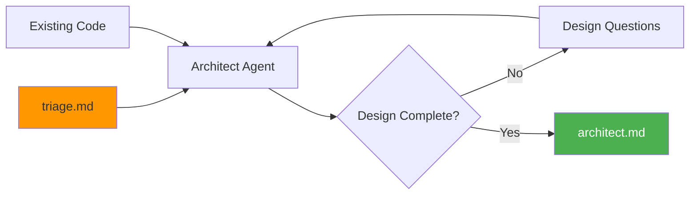

# Architect Stage

Architect is the second stage of the prep pipeline. It translates the refined requirements from triage into a technical design that balances project needs with pragmatic engineering decisions.

## What Architect Does

The architect stage:

- Reviews the triage output for requirements context
- Explores existing codebase (if extending a project)
- Conducts a technical interview to understand constraints
- Produces an architecture document with technology choices and component design



## Running Architect

### Standard Usage

```bash
cub architect
```

This uses the most recent session. The architect agent reads `triage.md` and launches an interactive design session.

### Specify Session

```bash
cub architect --session myproject-20260117-143022
```

### Non-Interactive Mode

```bash
cub architect --non-interactive --session myproject-20260117-143022
```

!!! note "Requires Triage"
    Architect requires a completed triage. If triage.md doesn't exist, you'll be prompted to run `cub triage` first.

## The Architect Interview

The architect agent asks key questions to shape the design:

### Question 1: Technical Mindset

> What's the context for this project?
>
> - **Prototype**: Speed over quality. Shortcuts OK. Might throw it away.
> - **MVP**: Balance speed and quality. Expect to iterate.
> - **Production**: Quality-first. Maintainable, tested, scalable.
> - **Enterprise**: Maximum rigor. Security, compliance, audit trails.

### Question 2: Scale Expectations

> What usage do you anticipate?
>
> - **Personal**: Just you (1 user)
> - **Team**: Your team or company (10-100 users)
> - **Product**: Public product (1,000+ users)
> - **Internet-scale**: Millions of users, high availability

### Question 3: Tech Stack

> Any technology preferences or constraints?
>
> - Languages (preferred / must avoid)
> - Frameworks (preferred / must avoid)
> - Database (preferred / must avoid)
> - Infrastructure (cloud provider, deployment target)

### Question 4: Integrations

> What external systems does this need to connect to?
> (APIs, databases, auth providers, third-party services)

## How Mindset Shapes Design

The architect adapts recommendations based on your mindset:

### Prototype Mindset

```
+-- Single file or minimal structure
+-- SQLite, JSON files, or in-memory storage
+-- Skip tests and types if faster
+-- Hardcode what you can
+-- Monolith everything
```

### MVP Mindset

```
+-- Clean separation of concerns
+-- SQLite or PostgreSQL depending on needs
+-- Tests for critical paths
+-- Basic error handling
+-- Monolith with clear module boundaries
```

### Production Mindset

```
+-- Well-defined component architecture
+-- PostgreSQL or appropriate database for scale
+-- Comprehensive test coverage
+-- Proper error handling and logging
+-- API versioning if external-facing
```

### Enterprise Mindset

```
+-- Formal architecture documentation
+-- Security-first design (auth, encryption, audit)
+-- Compliance considerations
+-- High availability and disaster recovery
+-- Monitoring, alerting, observability
```

## Design Elements

The architect addresses these areas:

| Element | Description |
|---------|-------------|
| **System Overview** | High-level description of how components fit together |
| **Technology Stack** | Specific choices with rationale for each layer |
| **Components** | Major modules/services and their responsibilities |
| **Data Model** | Key entities and relationships |
| **APIs/Interfaces** | How components communicate |
| **Implementation Phases** | Logical order to build things |

## Output: architect.md

Architect produces a comprehensive technical design:

```markdown
# Architecture Design: {Project Name}

**Date:** 2026-01-17
**Mindset:** mvp
**Scale:** team
**Status:** Approved

---

## Technical Summary

2-3 paragraph overview of the architecture, key decisions,
and how components work together.

## Technology Stack

| Layer | Choice | Rationale |
|-------|--------|-----------|
| Language | Python 3.11 | Team familiarity, rich ecosystem |
| Framework | FastAPI | Async support, OpenAPI generation |
| Database | PostgreSQL | ACID compliance, JSON support |
| Infrastructure | Docker + Railway | Simple deployment, good DX |

## System Architecture

```
+------------------+     +------------------+
|   Web Client     |     |   Mobile App     |
+--------+---------+     +--------+---------+
         |                        |
         v                        v
+------------------------------------------+
|              API Gateway                  |
|            (FastAPI + Auth)               |
+------------------------------------------+
         |                        |
         v                        v
+------------------+     +------------------+
|  Business Logic  |     |   Background     |
|    Services      |     |     Workers      |
+------------------+     +------------------+
         |                        |
         +------------+-----------+
                      |
                      v
         +------------------+
         |   PostgreSQL     |
         +------------------+
```

## Components

### API Gateway
- **Purpose:** Handle HTTP requests, authentication, routing
- **Responsibilities:**
  - Request validation
  - JWT authentication
  - Rate limiting
- **Dependencies:** Auth service, business logic services
- **Interface:** REST API

### Business Logic Services
- **Purpose:** Core application logic
- **Responsibilities:**
  - Domain operations
  - Data validation
  - Event emission
- **Dependencies:** Database, cache
- **Interface:** Internal Python modules

## Data Model

### User
```
id: UUID - Primary key
email: String - Unique email
name: String - Display name
created_at: DateTime - Creation timestamp
```

### Relationships
- User -> Habits: One-to-many
- Habit -> Entries: One-to-many

## APIs / Interfaces

### REST API
- **Type:** REST/JSON
- **Purpose:** Client communication
- **Key Endpoints:**
  - `POST /auth/login`: User authentication
  - `GET /habits`: List user habits
  - `POST /habits/{id}/entries`: Log habit entry

## Implementation Phases

### Phase 1: Foundation
**Goal:** Basic infrastructure and auth
- Project setup and configuration
- Database schema and migrations
- Authentication flow

### Phase 2: Core Features
**Goal:** Habit tracking functionality
- Habit CRUD operations
- Entry logging
- Basic reporting

### Phase 3: Polish
**Goal:** Production readiness
- Error handling improvements
- Performance optimization
- Documentation

## Technical Risks

| Risk | Impact | Likelihood | Mitigation |
|------|--------|------------|------------|
| Auth complexity | M | M | Use proven library (passlib) |
| Scale issues | H | L | Design for horizontal scale |

## Dependencies

### External
- PostgreSQL 15+
- Redis (optional caching)

### Internal
- triage.md requirements

## Security Considerations

- JWT tokens with short expiry
- Password hashing with bcrypt
- HTTPS only in production
- Input sanitization

## Future Considerations

- Mobile native apps (currently web-only)
- Multi-tenant support
- Real-time sync via WebSockets

---

**Next Step:** Run `cub plan` to generate implementation tasks.
```

## Existing Project Analysis

When extending an existing project, the architect agent first explores your codebase:

```
Architect Agent: I see this is an existing project. Let me explore...

Found:
- Python project with FastAPI (pyproject.toml)
- Existing auth module (src/auth/)
- SQLAlchemy models (src/models/)
- CLAUDE.md with conventions

I'll design the new features to integrate with your existing patterns.
```

The agent respects existing:

- Directory structure and organization
- Coding conventions (from CLAUDE.md)
- Technology choices already in use
- Established patterns and abstractions

## CLI Reference

```
Usage: cub architect [OPTIONS] [SESSION_ID]

Stage 2: Technical Design

Arguments:
  SESSION_ID         Session ID from triage (default: most recent)

Options:
  --session ID       Specify session ID
  --non-interactive  Run without interactive Claude session
  -h, --help         Show this help message

Examples:
  cub architect                      # Use most recent session
  cub architect --session ID         # Specific session

Output:
  .cub/sessions/{session-id}/architect.md
```

## Principles

!!! tip "Right-Size the Solution"
    A prototype doesn't need microservices; an enterprise system needs more than SQLite.

!!! tip "Justify Choices"
    Every technology choice should have a reason tied to requirements.

!!! tip "Acknowledge Tradeoffs"
    Be explicit about what you're trading off and why.

!!! tip "Stay Practical"
    Recommend what will actually work, not what's theoretically ideal.

!!! tip "Consider the Builder"
    The Planner will turn this into tasks - make sure your design is actionable.

## Next Step

Once architecture is complete, proceed to task decomposition:

```bash
cub plan
```

[:octicons-arrow-right-24: Plan Stage](plan.md)
