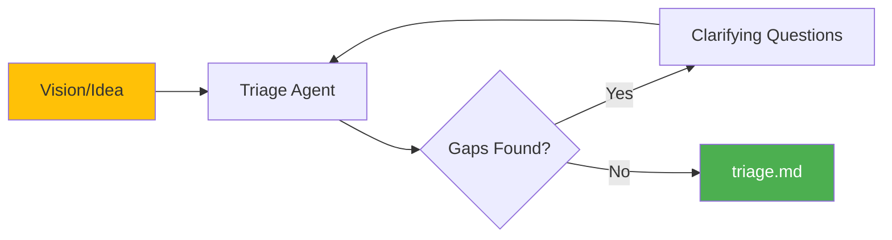

# Triage Stage

Triage is the first stage of the prep pipeline. It ensures product clarity before any technical work begins by refining requirements, identifying gaps, and producing a clear specification that the Architect can work from.

## What Triage Does

The triage stage:

- Reviews your vision document (or gathers requirements through interview)
- Identifies gaps, ambiguities, and unstated assumptions
- Challenges unclear requirements
- Produces a prioritized requirements document



## Running Triage

### Interactive Mode (Recommended)

Start a new triage session:

```bash
cub triage
```

This launches Claude Code with the triage skill, which conducts an interactive interview to refine your requirements.

### Resume Existing Session

```bash
cub triage --session myproject-20260117-143022
```

### Non-Interactive Mode

For automated workflows:

```bash
cub triage --non-interactive --vision VISION.md
```

!!! warning "Best-Effort"
    Non-interactive mode makes assumptions when details are missing. The output may include a "Needs Human Input" section with blocking questions.

## The Triage Interview

The triage agent asks these key questions:

### Question 1: Triage Depth

> How thorough should this product review be?
>
> - **Light**: Quick coherence check (~5 min)
> - **Standard**: Full product review (~15 min)
> - **Deep**: Include market/feasibility analysis (~30 min)

### Question 2: Core Problem

> In one sentence, what problem does this solve? Who has this problem?

### Question 3: Success Criteria

> How will you know this project succeeded? What's the measurable outcome?

### Question 4: Constraints

> Are there any hard constraints? (timeline, budget, tech stack, regulations)

### Question 5: MVP Definition

> What's the MVP - the smallest thing that would be useful?

### Question 6: Concerns

> What are you most worried about or uncertain about?

## Gap Analysis

Based on the triage depth, the agent analyzes your vision for:

### Light Triage
- Is there a clear problem statement?
- Is there enough detail to start building?
- Are there obvious contradictions?

### Standard Triage (includes Light)
- **Completeness**: Missing user stories, edge cases, error handling
- **Clarity**: Ambiguous terms that could mean multiple things
- **Assumptions**: Unstated assumptions
- **Dependencies**: External factors the project relies on
- **Risks**: What could go wrong

### Deep Triage (includes Standard)
- **Desirability**: Is there evidence users want this?
- **Feasibility**: Can this be built with reasonable effort?
- **Viability**: Should this be built? Opportunity cost?
- **Competition**: What else exists? How is this different?

## Positioning Unknowns

For things that can't be answered upfront, triage frames them as experiments:

> "We don't know if users will prefer X or Y. We can build this as an A/B test and let data decide."

This keeps the project moving while acknowledging uncertainty.

## Output: triage.md

Triage produces a structured requirements document:

```markdown
# Triage Report: {Project Name}

**Date:** 2026-01-17
**Triage Depth:** standard
**Status:** Approved

---

## Executive Summary

Brief summary of what we're building and why.

## Problem Statement

Clear articulation of the problem being solved and who has it.

## Refined Vision

Unambiguous statement of what will be built.

## Requirements

### P0 - Must Have
- Requirement with rationale

### P1 - Should Have
- Requirement with rationale

### P2 - Nice to Have
- Requirement with rationale

## Constraints

- Timeline constraint and impact
- Technical constraint and impact

## Assumptions

- Assumption we're proceeding with

## Open Questions / Experiments

- Unknown -> Experiment: how we'll learn

## Out of Scope

- Explicitly excluded item

## Risks

| Risk | Impact | Mitigation |
|------|--------|------------|
| Risk description | H/M/L | Strategy |

## MVP Definition

The smallest useful thing we can build.

---

**Next Step:** Run `cub architect` to proceed to technical design.
```

## Vision Document Discovery

Triage looks for vision documents in this order:

1. **Explicit path**: `cub triage --vision path/to/doc.md`
2. **VISION.md**: In project root
3. **docs/PRD.md**: Product requirements document
4. **README.md**: Fallback

If no document is found, the triage agent will ask you to describe your idea.

## Example Triage Session

```
$ cub triage

Starting new triage session: myproject-20260117-143022
Starting triage interview...

[Claude Code launches with /cub:triage skill]

Triage Agent: I found VISION.md in your project root.
Let me ask a few questions to refine the requirements...

How thorough should this product review be?
- Light: Quick coherence check (~5 min)
- Standard: Full product review (~15 min)
- Deep: Include market/feasibility analysis (~30 min)

> standard

In one sentence, what problem does this solve?

> Users can't easily track their daily habits across devices.

How will you know this project succeeded?

> 1000 daily active users within 3 months of launch.

[... more questions ...]

Here's the triage report. Please review:

[Shows triage.md content]

Reply with:
- approved to save and proceed
- revise: [feedback] to make changes

> approved

Triage complete!
Output saved to: .cub/sessions/myproject-20260117-143022/triage.md

Next step: cub architect
```

## Handling "Needs Human Input"

If triage cannot proceed without critical information, it marks the output as needing human input:

```
Triage needs human input before continuing.
Output: .cub/sessions/myproject-20260117-143022/triage.md

## Needs Human Input

1. What authentication method should be used? (OAuth, email/password, magic links)
2. Is there a specific database requirement?
3. What's the target deployment environment?
```

Answer these questions in the triage.md file or re-run triage to provide the answers interactively.

## CLI Reference

```
Usage: cub triage [OPTIONS]

Stage 1: Requirements Refinement

Options:
  --session ID         Resume an existing session
  --vision PATH        Vision/input markdown file
  --non-interactive    Run without interactive Claude session
  -h, --help           Show this help message

Examples:
  cub triage                      # Start new session
  cub triage --session ID         # Resume session
  cub triage --vision VISION.md   # Use specific vision file

Output:
  .cub/sessions/{session-id}/triage.md
```

## Principles

!!! tip "Push Back Constructively"
    Triage's job is to make the vision clearer, not rubber-stamp it.

!!! tip "Ask Why"
    Surface assumptions by asking why things need to be a certain way.

!!! tip "Be Direct"
    If something is unclear or missing, say so plainly.

!!! tip "Frame, Don't Block"
    Position unknowns as experiments rather than blockers.

!!! tip "Stay Product-Focused"
    Technical concerns belong to the Architect phase.

## Next Step

Once triage is complete, proceed to technical design:

```bash
cub architect
```

[:octicons-arrow-right-24: Architect Stage](architect.md)
