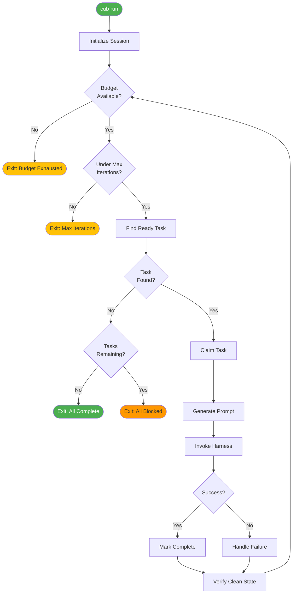

# The Run Loop

The run loop is Cub's core execution engine. When you run `cub run`, it enters an autonomous loop that picks tasks, executes them with an AI harness, and continues until stopped.

## The Ralph Wiggum Technique

Cub's run loop implements what's known as the [Ralph Wiggum technique](https://ghuntley.com/ralph/) - a pattern for reliable autonomous AI coding sessions:

1. **Prepare clear, scoped tasks** before execution
2. **Run the AI in a loop** that handles task selection automatically
3. **Let the loop continue** until work is done or budget is exhausted
4. **Verify outputs** through tests, type checks, and clean state verification

The key insight: invest time *before* code starts flying (in the prep phase), then step back and let execution happen autonomously.

## Loop Flow



## How It Works

### 1. Initialize Session

Cub sets up the execution environment:

- Loads configuration (global + project + env vars)
- Detects task backend (beads or JSON)
- Detects AI harness (claude, codex, etc.)
- Initializes budget tracking
- Creates session ID for logging

### 2. Find Ready Task

Each iteration:

1. Query backend for tasks with `status == "open"`
2. Filter to tasks where all `dependsOn` are `closed`
3. Apply epic/label filters if specified
4. Sort by priority (P0 first)
5. Select the first task

See [Task Selection](selection.md) for the full algorithm.

### 3. Claim Task

Before execution:

- Set task status to `in_progress`
- Set assignee to current session ID
- Prevents concurrent work on the same task

### 4. Generate Prompt

Cub builds a prompt for the AI harness:

```
System Prompt (from PROMPT.md)
---
Task Prompt:
  - Task ID and title
  - Full description
  - Acceptance criteria
  - Completion instructions
  - Backend-specific commands
```

### 5. Invoke Harness

Execute the AI on the task:

- Pass system and task prompts
- Enable auto/autonomous mode
- Stream output if configured
- Track token usage

### 6. Check Result

After the harness exits:

- **Success (exit 0)**: Task should be closed by the AI
- **Failure (exit != 0)**: Handle according to config

### 7. Verify and Continue

- Verify clean git state if configured
- Update task counts
- Log metrics (tokens, duration, cost)
- Continue to next iteration

## Exit Conditions

The loop exits when any of these occur:

| Condition | Exit Code | Description |
|-----------|-----------|-------------|
| **All tasks complete** | 0 | No more open tasks |
| **Budget exhausted** | 0 | Token budget exceeded |
| **Max iterations reached** | 0 | Loop limit hit |
| **All tasks blocked** | 0 | Open tasks exist but dependencies unsatisfied |
| **--once flag** | 0 | Single iteration mode |
| **Task failure (stop mode)** | 1 | Task failed and `on_failure` is "stop" |
| **Interrupt (Ctrl+C)** | 130 | User cancelled |

## Running the Loop

### Basic Execution

```bash
# Run until complete or budget exhausted
cub run
```

### Single Iteration

```bash
# Run one task then exit
cub run --once
```

### Stream Output

```bash
# Watch AI output in real-time
cub run --stream
```

### With Dashboard

```bash
# Split terminal with live monitoring
cub run --monitor
```

### Target Specific Work

```bash
# Run a specific task
cub run --task cub-042

# Run tasks in an epic
cub run --epic cub-epic-001

# Run tasks with a label
cub run --label frontend
```

### Budget Controls

```bash
# Set token budget
cub run --budget 500000

# Set iteration limit
cub run --max-iterations 10
```

## Configuration

Key settings that affect the loop:

```json
{
  "loop": {
    "max_iterations": 100,
    "on_task_failure": "move-on"
  },
  "budget": {
    "default": 1000000,
    "warn_at": 0.8
  },
  "guardrails": {
    "max_task_iterations": 3
  },
  "clean_state": {
    "require_commit": true
  },
  "task": {
    "auto_close": true
  }
}
```

See [Configuration Reference](../configuration/reference.md) for all options.

## Monitoring Progress

### Real-Time Dashboard

```bash
# In a separate terminal
cub monitor
```

### Status Check

```bash
cub status
```

### View Ready Tasks

```bash
cub run --ready
```

### View Logs

```bash
# Recent session logs
ls -la ~/.local/share/cub/logs/$(basename $(pwd))/

# Parse structured logs
jq '.event_type' ~/.local/share/cub/logs/myproject/*.jsonl | sort | uniq -c
```

## Failure Handling

When a task fails, behavior depends on `loop.on_task_failure`:

| Mode | Behavior |
|------|----------|
| `stop` | Exit immediately with error |
| `move-on` | Mark task failed, continue to next |
| `retry` | Retry with additional context |
| `triage` | Pause for human intervention |

```bash
# Override failure handling
cub run --on-failure move-on
```

## Parallel Execution

Run multiple tasks concurrently using git worktrees:

```bash
# Run 3 independent tasks in parallel
cub run --parallel 3
```

Each task gets its own worktree for isolation. Only independent tasks (no shared dependencies) are selected.

See [Parallel Execution](../advanced/parallel.md) for details.

## Sandbox Mode

Run in Docker for isolation:

```bash
# Run in sandbox
cub run --sandbox

# Sandbox without network
cub run --sandbox --no-network
```

See [Sandbox Mode](../advanced/sandbox.md) for details.

## Session Artifacts

Each run creates artifacts in `.cub/runs/{session}/`:

```
.cub/runs/cub-20260117-143022/
+-- run.json              # Run metadata
+-- status.json           # Current status
+-- tasks/
    +-- cub-042/
        +-- task.json     # Task execution details
        +-- summary.md    # AI-generated summary
        +-- changes.patch # Git diff
```

## Next Steps

<div class="grid cards" markdown>

-   :material-magnify: **[Task Selection](selection.md)**

    ---

    Deep dive into how tasks are prioritized and selected.

-   :material-check-circle: **[Task Completion](completion.md)**

    ---

    How tasks are marked complete and verified.

</div>
