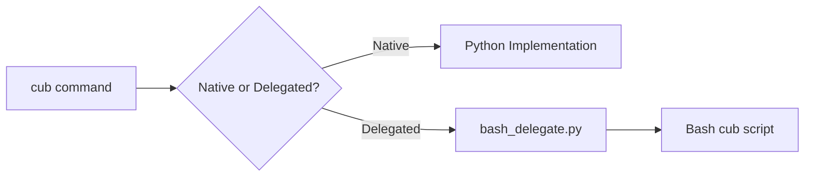
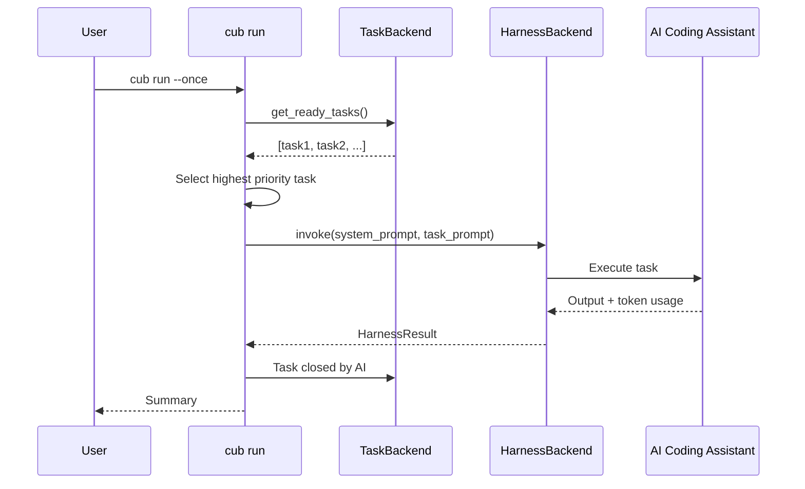
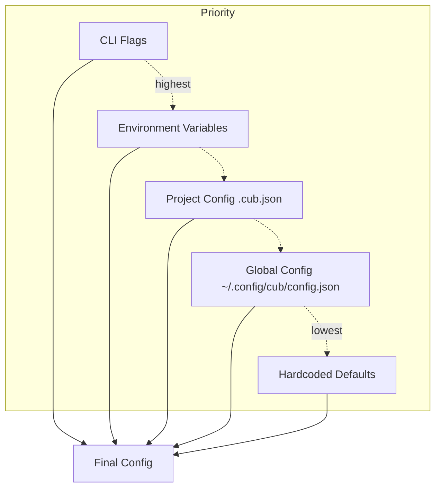

# Architecture Overview

Cub uses a hybrid Python/Bash architecture to enable gradual migration while maintaining backwards compatibility. Core commands are implemented in Python, with advanced features still in Bash.

## Architecture Diagram

```
+-------------------------------------------------------------------------+
|                           cub (Python CLI)                               |
|                             Typer app                                    |
+-------------------------+-----------------------------------------------+
|   Native Commands       |   Delegated Commands                          |
|   (Python)              |   (Bash via bash_delegate.py)                 |
+-------------------------+-----------------------------------------------+
| run, status, init       | prep, triage, architect, plan                 |
| monitor                 | branch, branches, pr, checkpoints             |
|                         | interview, doctor, upgrade                     |
+-------------------------+-----------------------------------------------+
|                           Core Modules (Python)                          |
+------------------+-----------------+------------------------------------+
|  cub.core.tasks  |  cub.core.harness |  cub.core.config                 |
|  (Protocol-based |  (Protocol-based  |  (Pydantic models)               |
|   backends)      |   backends)       |                                  |
+--------+---------+-------+---------+------------------------------------+
| beads  |   json  | claude |  codex  |  gemini  | opencode               |
+--------+---------+--------+---------+----------+-------------------------+
```

## Design Principles

### Protocol-Based Backends

Cub uses Python's `typing.Protocol` for pluggable backends rather than abstract base classes. This provides:

- **Structural typing** - Any class with the right methods is compatible
- **No inheritance required** - Backends don't need to inherit from a base class
- **Better testability** - Easy to create mock implementations

```python
from typing import Protocol, runtime_checkable

@runtime_checkable
class HarnessBackend(Protocol):
    """All harness backends implement this interface."""

    @property
    def name(self) -> str: ...

    def is_available(self) -> bool: ...

    def invoke(self, system_prompt: str, task_prompt: str, ...) -> HarnessResult: ...
```

### Hybrid CLI Architecture

The hybrid architecture allows:

1. **Gradual migration** - Port commands to Python incrementally
2. **Backwards compatibility** - Existing bash commands continue working
3. **Best of both worlds** - Python for complex logic, bash for rapid prototyping



---

## Module Structure

### Project Layout

```
src/cub/
+-- cli/                  # Typer CLI subcommands
|   +-- __init__.py      # Main app registration
|   +-- app.py           # Main Typer app
|   +-- run.py           # cub run subcommand
|   +-- status.py        # cub status subcommand
|   +-- init_cmd.py      # cub init subcommand
|   +-- monitor.py       # cub monitor subcommand
|   +-- delegated.py     # Bash-delegated commands
|   +-- ...
+-- core/                 # Core logic (CLI-independent)
|   +-- config.py        # Configuration loading/merging
|   +-- models.py        # Pydantic models (Task, Config, etc.)
|   +-- bash_delegate.py # Bash command delegation
|   +-- tasks/           # Task backends
|   |   +-- backend.py   # TaskBackend protocol
|   |   +-- beads.py     # Beads backend
|   |   +-- json.py      # JSON backend
|   +-- harness/         # AI harness backends
|       +-- backend.py   # HarnessBackend protocol
|       +-- claude.py    # Claude Code harness
|       +-- codex.py     # OpenAI Codex harness
|       +-- gemini.py    # Google Gemini harness
|       +-- opencode.py  # OpenCode harness
+-- utils/                # Utilities
|   +-- hooks.py         # Hook execution system
|   +-- status.py        # Status display (Rich tables)
+-- bash/                 # Bundled bash cub script
|   +-- cub              # Main bash script
+-- templates/            # Project templates
    +-- PROMPT.md        # System prompt template
    +-- AGENT.md         # Agent instructions template
```

### Key Modules

| Module | Purpose |
|--------|---------|
| `cub.cli.app` | Main Typer CLI application and command registration |
| `cub.core.config` | Configuration loading with precedence: env vars > project > global > defaults |
| `cub.core.models` | Pydantic data models (Task, Config, RunMetadata, etc.) |
| `cub.core.tasks.backend` | TaskBackend protocol and registry |
| `cub.core.harness.backend` | HarnessBackend protocol and registry |
| `cub.core.bash_delegate` | Bash command delegation and discovery |
| `cub.utils.hooks` | Hook execution system |

---

## Data Flow

### Run Loop Flow

The main execution flow when running `cub run`:



### Configuration Flow

Configuration is loaded with clear precedence:



---

## Command Routing

### Native Commands (Python)

Commands fully implemented in Python execute directly:

```python
# src/cub/cli/run.py
@app.command()
def run(
    once: bool = typer.Option(False, "--once", help="Run single iteration"),
    harness: str = typer.Option(None, help="Harness to use"),
    ...
) -> None:
    """Execute tasks with AI harness."""
    # Direct Python implementation
```

### Delegated Commands (Bash)

Commands not yet ported delegate to bash:

```python
# src/cub/cli/delegated.py
def prep(ctx: typer.Context, args: list[str] | None = typer.Argument(None)) -> None:
    """Run full prep pipeline (triage -> architect -> plan -> bootstrap)."""
    _delegate("prep", args or [], ctx)
```

The delegation mechanism:

1. **Script discovery** - Finds bash cub in bundled package, project root, or PATH
2. **Argument forwarding** - CLI args passed directly to bash
3. **Exit code passthrough** - Bash exit codes propagated to caller

---

## Backend Registration

Both task and harness backends use a decorator-based registry:

### Registering a Harness

```python
from cub.core.harness.backend import register_backend

@register_backend("myharness")
class MyHarnessBackend:
    @property
    def name(self) -> str:
        return "myharness"

    # ... implement protocol methods
```

### Registering a Task Backend

```python
from cub.core.tasks.backend import register_backend

@register_backend("mybackend")
class MyTaskBackend:
    # ... implement protocol methods
```

### Auto-Detection

Backends are auto-detected based on availability:

```python
# Harness detection order
detect_harness()  # claude > opencode > codex > gemini

# Task backend detection
detect_backend()  # .beads/ -> beads, prd.json -> json, default -> json
```

---

## Migration Status

### Native Python Commands

| Command | Status | Module |
|---------|--------|--------|
| `run` | Complete | `cub.cli.run` |
| `status` | Complete | `cub.cli.status` |
| `init` | Complete | `cub.cli.init_cmd` |
| `monitor` | Complete | `cub.cli.monitor` |

### Delegated Bash Commands

| Command | Category | Notes |
|---------|----------|-------|
| `prep` | Pipeline | Full prep pipeline |
| `triage` | Pipeline | Requirements refinement |
| `architect` | Pipeline | Technical design |
| `plan` | Pipeline | Task decomposition |
| `bootstrap` | Pipeline | Initialize tasks |
| `interview` | Tasks | Task specification deep-dive |
| `branch` | Git | Branch-epic binding |
| `branches` | Git | Manage branch bindings |
| `pr` | Git | Create pull requests |
| `doctor` | Install | Diagnose issues |
| `upgrade` | Install | Upgrade cub |

---

## Next Steps

<div class="grid cards" markdown>

-   :material-code-braces: **Development Setup**

    ---

    Set up your environment to start contributing.

    [:octicons-arrow-right-24: Setup Guide](setup.md)

-   :material-robot: **Adding Harnesses**

    ---

    Add support for new AI coding assistants.

    [:octicons-arrow-right-24: Harness Guide](harnesses.md)

</div>
