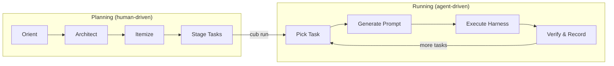
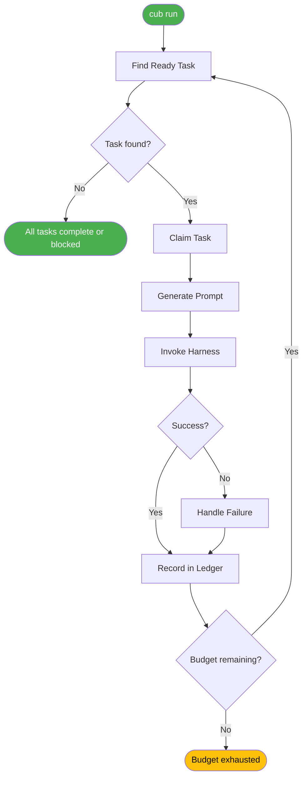
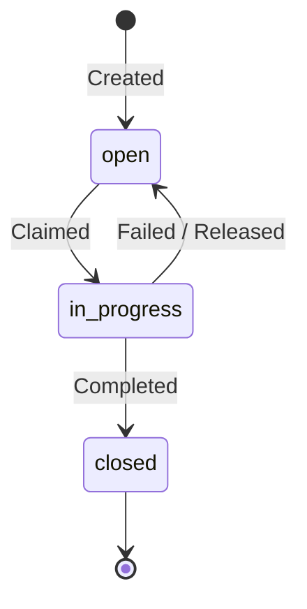

# Core Concepts

Cub has a small number of ideas that, once internalized, make everything else predictable. This page teaches those mental models. Each section covers one concept with enough depth to reason about it, then points you to the full guide.

---

## The Two Phases

All work in Cub flows through two distinct phases with different owners.

**Planning** is human-driven. You describe what you want, refine requirements, decompose work into agent-sized tasks, and arrange them into epics. This is where judgment lives — scoping, prioritization, dependency ordering. Cub's planning tools (`cub plan orient`, `cub plan architect`, `cub plan itemize`) assist, but you make the decisions.

**Running** is agent-driven. Once tasks exist, `cub run` takes over. It picks the next ready task, assembles a prompt, invokes an AI harness, verifies results, records outcomes, and loops. You step away. The quality of the run depends almost entirely on the quality of the planning.



The separation exists because investing time *before* code starts flying makes autonomous execution reliable. Vague instructions produce vague results. Structured tasks with clear acceptance criteria produce working code.

:material-arrow-right: [Plan Pipeline Guide](../guide/prep-pipeline/index.md) | [Run Loop Guide](../guide/run-loop/index.md)

---

## The Autonomous Loop

The run loop is Cub's execution engine. Understanding its cycle explains most of Cub's behavior.

Each iteration follows the same steps:

1. **Find a ready task** — status is `open`, all dependencies are `closed`, respects priority ordering
2. **Claim it** — set status to `in_progress` so nothing else picks it up
3. **Generate a prompt** — assemble context from multiple layers (see [Context Composition](#context-composition) below)
4. **Invoke the harness** — hand the prompt to the AI coding assistant and let it work
5. **Verify the result** — did the task close? is git state clean? did tests pass?
6. **Record the outcome** — write a ledger entry with what happened, what changed, and what it cost
7. **Loop or exit** — continue to the next task, or stop if budget is exhausted, all tasks are done, or the circuit breaker fires



The loop is stateless between iterations. Each cycle reads the current state of the world (task backend, git, config) and makes a fresh decision. This means you can modify tasks, change priorities, or even add new tasks while the loop is running.

:material-arrow-right: [Run Loop Guide](../guide/run-loop/index.md)

---

## Harnesses

A **harness** is Cub's abstraction over an AI coding CLI. Cub does not contain an AI model — it wraps tools that do.

The supported harnesses are:

| Harness | Wraps | Binary |
|---------|-------|--------|
| `claude` | Claude Code | `claude` |
| `codex` | OpenAI Codex CLI | `codex` |
| `gemini` | Google Gemini CLI | `gemini` |
| `opencode` | OpenCode | `opencode` |

Why the abstraction? Because harnesses differ in capabilities (streaming, token reporting, system prompts, hooks), and Cub adapts its behavior to each one. A task prompt that works with Claude Code will also work with Codex — Cub handles the translation. This lets you switch harnesses without rewriting your tasks.

**Detection** works by checking which binaries are available on your system. Cub tries them in a default priority order (`claude > opencode > codex > gemini`) and uses the first one found. Override with `--harness claude` or the `harness` key in `.cub/config.json`.

```bash
# Auto-detect (uses first available)
cub run

# Explicit selection
cub run --harness codex
```

:material-arrow-right: [AI Harnesses Guide](../guide/harnesses/index.md)

---

## Tasks and Epics

Tasks are the atomic unit of work. Epics group related tasks. Together they form a hierarchy that Cub navigates during execution.

### Task ID Format

Every task ID encodes its position in the hierarchy:

```
{project}-{epic}.{task}
```

| Component | Example | Purpose |
|-----------|---------|---------|
| Project | `cub` | Which project this belongs to |
| Epic | `048a-5` | Groups related work together |
| Task | `4` | Individual item within the epic |

Full example: `cub-048a-5.4` — task 4 in epic `048a-5` of project `cub`.

### Lifecycle

Tasks move through three states:



**open** — Ready for work (if dependencies are met). This is the starting state.

**in_progress** — Claimed by a session. Only one session works a task at a time.

**closed** — Done. The harness completed the work and signaled closure.

### Epics

An epic is a task of type `epic` that serves as a parent for other tasks. The `parent` field on child tasks points to the epic's ID. Cub uses this to:

- Filter runs to a specific epic (`cub run --epic cub-048a-5`)
- Generate epic context in prompts (sibling task status, overall progress)
- Organize ledger entries by epic for reporting

:material-arrow-right: [Task Management Guide](../guide/tasks/index.md)

---

## The Ledger

The ledger is Cub's permanent record of completed work. Every time a task finishes — whether through `cub run` or a direct session — the ledger captures what happened.

A ledger entry records:

| Field | What it captures |
|-------|-----------------|
| Task ID | Which task was completed |
| Session ID | Which execution session did the work |
| Files changed | List of files created, modified, or deleted |
| Git commits | Commit hashes and messages produced |
| Cost and tokens | How much the execution cost |
| Duration | Wall-clock time for the task |
| Summary | What the agent actually did |

Entries are stored as JSONL in `.cub/ledger/` and organized into three indices for efficient querying:

```
.cub/ledger/
  index.jsonl              # All entries, chronological
  by-task/{task_id}/       # Grouped by task
  by-epic/{epic_id}/       # Grouped by epic
  by-run/{run_id}/         # Grouped by session
  forensics/               # Raw session event logs
```

The ledger matters because it closes the feedback loop. Without it, you finish a coding session and lose the context of what happened, what it cost, and what patterns are emerging. With it, you can query trends, run retrospectives (`cub retro`), and extract lessons (`cub learn extract`).

```bash
# View recent ledger entries
cub ledger show

# Search the ledger
cub ledger search "authentication"

# Get aggregate statistics
cub ledger stats
```

:material-arrow-right: [Ledger Commands](../guide/run-loop/completion.md)

---

## Context Composition

When Cub generates a prompt for the harness, it assembles context from five layers. Understanding these layers explains why the agent behaves the way it does — and how to influence it.

```
Layer 1: Runloop (.cub/runloop.md)
  Core workflow instructions. How to claim tasks, run tests,
  signal completion. Managed by cub init.

Layer 2: Plan Context (plans/<slug>/prompt-context.md)
  Problem statement, requirements, technical approach.
  Generated by cub stage from planning artifacts.

Layer 3: Epic Context (generated dynamically)
  Parent epic details, sibling task status, overall progress.
  Helps the agent understand the bigger picture.

Layer 4: Task Context (current task)
  Task ID, title, description, acceptance criteria,
  backend-specific closure instructions.

Layer 5: Retry Context (if applicable)
  Previous attempt summaries and failure logs.
  Prevents the agent from repeating the same mistakes.
```

Context composition happens at **runtime**, not through file mutation. The runloop template stays the same; plan context lives in its plan directory; everything merges when the prompt is generated. This means you can customize agent behavior at the right level:

- **Change how all tasks execute**: edit `.cub/runloop.md`
- **Change context for a specific plan**: edit `plans/<slug>/prompt-context.md`
- **Change project-wide instructions**: edit `CLAUDE.md` (symlinked to `.cub/agent.md`)
- **Change a single task's behavior**: edit the task description or acceptance criteria

:material-arrow-right: [Configuration Guide](../guide/configuration/index.md)

---

## Symbiotic Workflow

Cub supports two ways of working with AI coding assistants, and the **symbiotic workflow** bridges them.

**CLI-driven** (`cub run`): Cub controls the session. It picks tasks, generates prompts, invokes the harness, and records results. Fully autonomous.

**Interactive** (direct Claude Code session): You control the session. You open Claude Code, talk to it, write code together. Cub has no visibility into what happened — unless hooks are installed.

**Hooks are the bridge.** When you run `cub init`, Cub installs lightweight hooks into Claude Code's event system. These hooks observe what happens during direct sessions and feed it back into Cub's ledger:

| Hook Event | What it captures |
|------------|-----------------|
| `SessionStart` | Injects available tasks and project context |
| `PostToolUse` | Tracks file writes, task commands, git commits |
| `Stop` | Finalizes the session and creates a ledger entry |
| `PreCompact` | Checkpoints state before context compaction |

The result: whether you use `cub run` or work directly in Claude Code, the ledger stays complete. Task state, file changes, and session metadata are captured either way.

```bash
# In a direct Claude Code session, claim and close tasks manually
cub task claim cub-048a-5.4
# ... do the work ...
cub task close cub-048a-5.4 -r "Implemented the feature"
```

When `cub run` invokes Claude Code as a harness, hooks are automatically disabled for that session (via `CUB_RUN_ACTIVE`) to prevent double-tracking. Hooks only activate for direct, interactive sessions.

:material-arrow-right: [Hooks Guide](../guide/hooks/index.md)

---

## Budget and Guardrails

Autonomous AI sessions can consume significant resources. Cub provides multiple layers of protection so you can step away with confidence.

### Budget Controls

Set spending limits in USD or tokens:

```bash
# Cap this run at $10
cub run --budget 10

# Cap at 500K tokens
cub run --budget-tokens 500000
```

Or configure defaults in `.cub/config.json`:

```json
{
  "budget": {
    "max_tokens_per_task": 500000,
    "max_total_cost": 10.0
  }
}
```

When a budget limit is reached, the current task finishes, the result is recorded, and the loop exits gracefully.

### Circuit Breaker

The circuit breaker detects **stagnation** — when the agent is spinning without making progress. If the same task fails repeatedly, or the agent produces no meaningful output across iterations, the circuit breaker trips and halts execution. This prevents burning budget on a task the agent cannot solve.

### Clean State Requirements

By default, Cub verifies git state is clean between iterations. This catches cases where the agent left uncommitted changes, merge conflicts, or other problems that would compound across tasks. Configure this in `.cub/config.json`:

```json
{
  "state": {
    "require_clean": true,
    "run_tests": true,
    "run_typecheck": false
  }
}
```

Together, budgets, the circuit breaker, and clean state verification form a safety net that makes "set and forget" practical rather than reckless.

:material-arrow-right: [Budget and Guardrails Guide](../guide/budget/index.md)

---

## Next Steps

Now that you have the mental models:

- **[Quick Start](quickstart.md)** — Run your first autonomous session
- **[Configuration Guide](../guide/configuration/index.md)** — Customize Cub for your workflow
- **[Plan Pipeline](../guide/prep-pipeline/index.md)** — Master the planning phase
- **[Run Loop](../guide/run-loop/index.md)** — Deep dive on execution
- **[AI Harnesses](../guide/harnesses/index.md)** — Harness capabilities and selection
