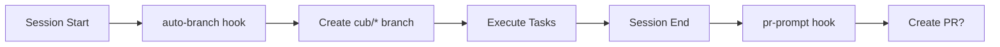

# Hook Examples

This page provides ready-to-use hook scripts for common integrations. Each example includes installation instructions, configuration options, and customization tips.

## Auto-Branch Hook

Automatically creates a git branch when a cub session starts.

### Location

`pre-loop.d/10-auto-branch.sh`

### Installation

```bash
# For a specific project
mkdir -p .cub/hooks/pre-loop.d
cp examples/hooks/pre-loop.d/10-auto-branch.sh .cub/hooks/pre-loop.d/
chmod +x .cub/hooks/pre-loop.d/10-auto-branch.sh

# Or for all projects (global)
mkdir -p ~/.config/cub/hooks/pre-loop.d
cp examples/hooks/pre-loop.d/10-auto-branch.sh ~/.config/cub/hooks/pre-loop.d/
chmod +x ~/.config/cub/hooks/pre-loop.d/10-auto-branch.sh
```

### Behavior

- Creates branch: `cub/{session_name}/{timestamp}`
- Stores base branch in `.cub/.base-branch` for later PR creation
- Idempotent: safe to run multiple times
- Skips if not in a git repository or already on a cub branch

### Example Output

```
[auto-branch] Creating branch: cub/porcupine/20260111-120000 (from main)
[auto-branch] Stored base branch: main
```

### Script

```bash
#!/usr/bin/env bash
#
# Auto-Branch Creation Hook
#
# Automatically creates a new git branch when a cub session starts.
# Uses the cub branch naming convention: cub/{session_name}/{timestamp}

set -euo pipefail

# Get context from environment
PROJECT_DIR="${CUB_PROJECT_DIR:-.}"
SESSION_ID="${CUB_SESSION_ID:-}"

# Change to project directory
cd "$PROJECT_DIR"

# Skip if not in a git repository
if ! git rev-parse --is-inside-work-tree >/dev/null 2>&1; then
    echo "[auto-branch] Not in a git repository, skipping branch creation"
    exit 0
fi

# Skip if no session ID
if [[ -z "$SESSION_ID" ]]; then
    echo "[auto-branch] No session ID available, skipping branch creation"
    exit 0
fi

# Extract session name from session ID (format: name-YYYYMMDD-HHMMSS)
SESSION_NAME="${SESSION_ID%-*-*}"
if [[ -z "$SESSION_NAME" || "$SESSION_NAME" == "$SESSION_ID" ]]; then
    SESSION_NAME="${SESSION_ID%%-*}"
fi

# Check if already on a cub branch
CURRENT_BRANCH=$(git rev-parse --abbrev-ref HEAD 2>/dev/null || echo "")
if [[ "$CURRENT_BRANCH" == cub/* ]]; then
    echo "[auto-branch] Already on cub branch: $CURRENT_BRANCH"
    exit 0
fi

# Store base branch for later PR creation
BASE_BRANCH="$CURRENT_BRANCH"
TIMESTAMP=$(date +%Y%m%d-%H%M%S)
BRANCH_NAME="cub/${SESSION_NAME}/${TIMESTAMP}"

# Check if branch already exists
if git rev-parse --verify "$BRANCH_NAME" >/dev/null 2>&1; then
    echo "[auto-branch] Branch '$BRANCH_NAME' already exists, checking out"
    git checkout "$BRANCH_NAME"
else
    echo "[auto-branch] Creating branch: $BRANCH_NAME (from $BASE_BRANCH)"
    git checkout -b "$BRANCH_NAME"
fi

# Store base branch in a file for post-loop PR creation
BASE_BRANCH_FILE="${PROJECT_DIR}/.cub/.base-branch"
mkdir -p "$(dirname "$BASE_BRANCH_FILE")"
echo "$BASE_BRANCH" > "$BASE_BRANCH_FILE"
echo "[auto-branch] Stored base branch: $BASE_BRANCH"

exit 0
```

---

## PR Prompt Hook

Offers to create a GitHub Pull Request at the end of a cub session.

### Location

`post-loop.d/90-pr-prompt.sh`

### Prerequisites

- GitHub CLI installed and authenticated: `brew install gh && gh auth login`
- Repository has a GitHub remote

### Installation

```bash
mkdir -p .cub/hooks/post-loop.d
cp examples/hooks/post-loop.d/90-pr-prompt.sh .cub/hooks/post-loop.d/
chmod +x .cub/hooks/post-loop.d/90-pr-prompt.sh
```

### Behavior

- Reads base branch from `.cub/.base-branch` (set by auto-branch hook)
- Generates PR title and body from commits
- Prompts user: yes/no/edit
- Skips if no commits, already on main, or PR exists

### Example Output

```
==========================================
[pr-prompt] Ready to create Pull Request
==========================================

Branch:  cub/porcupine/20260111-120000
Base:    main
Commits: 3 ahead

Title:   Cub: Porcupine session (3 commits)

[pr-prompt] Create PR? [y/N/e(dit)]
```

### Script (Excerpt)

```bash
#!/usr/bin/env bash
set -euo pipefail

PROJECT_DIR="${CUB_PROJECT_DIR:-.}"
cd "$PROJECT_DIR"

# Check if running interactively
if [[ ! -t 0 ]]; then
    echo "[pr-prompt] Not running interactively, skipping"
    exit 0
fi

# Check if gh CLI is installed
if ! command -v gh >/dev/null 2>&1; then
    echo "[pr-prompt] GitHub CLI not installed, skipping"
    exit 0
fi

# Get current and base branches
CURRENT_BRANCH=$(git rev-parse --abbrev-ref HEAD)
BASE_BRANCH=$(cat ".cub/.base-branch" 2>/dev/null || echo "main")

# Check commits ahead
COMMITS_AHEAD=$(git rev-list --count "${BASE_BRANCH}..HEAD" || echo "0")
if [[ "$COMMITS_AHEAD" == "0" ]]; then
    echo "[pr-prompt] No commits ahead of ${BASE_BRANCH}"
    exit 0
fi

# Generate PR title
SUGGESTED_TITLE="Cub: $(echo "$CURRENT_BRANCH" | cut -d'/' -f2) session ($COMMITS_AHEAD commits)"

# Prompt user
read -r -p "[pr-prompt] Create PR? [y/N/e(dit)] " response
case "$response" in
    [yY]*)
        gh pr create --title "$SUGGESTED_TITLE" --base "$BASE_BRANCH"
        ;;
    [eE]*)
        gh pr create --base "$BASE_BRANCH"
        ;;
esac

exit 0
```

---

## Slack Notification Hook

Posts task completion notifications to Slack.

### Location

`post-task.d/slack-notify.sh`

### Prerequisites

Get a Slack webhook URL from [Slack API](https://api.slack.com/messaging/webhooks).

### Installation

```bash
mkdir -p ~/.config/cub/hooks/post-task.d
cp examples/hooks/post-task/slack-notify.sh ~/.config/cub/hooks/post-task.d/01-slack.sh
chmod +x ~/.config/cub/hooks/post-task.d/01-slack.sh

# Set webhook URL
export SLACK_WEBHOOK_URL="https://hooks.slack.com/services/YOUR/WEBHOOK/URL"
```

### Configuration

| Variable | Required | Description |
|----------|----------|-------------|
| `SLACK_WEBHOOK_URL` | Yes | Slack incoming webhook URL |
| `SLACK_CHANNEL` | No | Channel to post to (default: webhook default) |

### Example Message

```
Task Completed: Implement user authentication
+----------------+--------------+
| Task ID        | cub-abc123   |
| Status         | Success      |
| Exit Code      | 0            |
| Branch         | feature/auth |
| Project        | my-project   |
| Commit         | abc1234      |
+----------------+--------------+
```

### Script

```bash
#!/usr/bin/env bash
set -euo pipefail

SLACK_WEBHOOK_URL="${SLACK_WEBHOOK_URL:-}"
PROJECT_DIR="${CUB_PROJECT_DIR:-.}"
TASK_ID="${CUB_TASK_ID:-unknown}"
TASK_TITLE="${CUB_TASK_TITLE:-No title}"
EXIT_CODE="${CUB_EXIT_CODE:-0}"

if [[ -z "$SLACK_WEBHOOK_URL" ]]; then
    echo "Skipping Slack notification: SLACK_WEBHOOK_URL not set"
    exit 0
fi

# Determine status
if [[ "$EXIT_CODE" -eq 0 ]]; then
    STATUS="Success"
    COLOR="good"
else
    STATUS="Failed"
    COLOR="danger"
fi

# Get git info
GIT_BRANCH=$(cd "$PROJECT_DIR" && git rev-parse --abbrev-ref HEAD 2>/dev/null || echo "unknown")
GIT_COMMIT=$(cd "$PROJECT_DIR" && git rev-parse --short HEAD 2>/dev/null || echo "unknown")

# Build payload
PAYLOAD=$(cat <<EOF
{
    "attachments": [{
        "color": "$COLOR",
        "title": "Task Completed: $TASK_TITLE",
        "fields": [
            {"title": "Task ID", "value": "$TASK_ID", "short": true},
            {"title": "Status", "value": "$STATUS", "short": true},
            {"title": "Branch", "value": "$GIT_BRANCH", "short": true},
            {"title": "Commit", "value": "$GIT_COMMIT", "short": true}
        ],
        "footer": "Cub Task Notifications",
        "ts": $(date +%s)
    }]
}
EOF
)

# Send to Slack
curl -s -X POST -H 'Content-type: application/json' \
    --data "$PAYLOAD" "$SLACK_WEBHOOK_URL"

exit 0
```

---

## Datadog Metrics Hook

Reports session metrics to Datadog.

### Location

`post-loop.d/datadog-metric.sh`

### Prerequisites

Get your Datadog API key from [Datadog Settings](https://app.datadoghq.com/organization/settings/api-keys).

### Installation

```bash
mkdir -p ~/.config/cub/hooks/post-loop.d
cp examples/hooks/post-loop/datadog-metric.sh ~/.config/cub/hooks/post-loop.d/01-datadog.sh
chmod +x ~/.config/cub/hooks/post-loop.d/01-datadog.sh

# Set API key
export DD_API_KEY="your-api-key"
```

### Configuration

| Variable | Required | Default | Description |
|----------|----------|---------|-------------|
| `DD_API_KEY` | Yes | - | Datadog API key |
| `DD_SITE` | No | `datadoghq.com` | Datadog site (US or EU) |
| `DD_TAGS` | No | - | Additional tags (comma-separated) |

### Metrics Sent

| Metric | Type | Description |
|--------|------|-------------|
| `cub.loop.completed` | gauge | Count of completed loops |
| `cub.loop.timestamp` | gauge | Timestamp for freshness tracking |

### Tags

All metrics include:
- `harness:{harness_name}`
- `project:{project_name}`
- `branch:{git_branch}`

### Script (Excerpt)

```bash
#!/usr/bin/env bash
set -euo pipefail

DD_API_KEY="${DD_API_KEY:-}"
DD_SITE="${DD_SITE:-datadoghq.com}"
PROJECT_DIR="${CUB_PROJECT_DIR:-.}"
HARNESS="${CUB_HARNESS:-unknown}"

if [[ -z "$DD_API_KEY" ]]; then
    echo "Skipping Datadog metric: DD_API_KEY not set"
    exit 0
fi

PROJECT_NAME=$(basename "$PROJECT_DIR")
GIT_BRANCH=$(cd "$PROJECT_DIR" && git rev-parse --abbrev-ref HEAD 2>/dev/null || echo "unknown")
TIMESTAMP=$(date +%s)

PAYLOAD=$(cat <<EOF
{
    "series": [{
        "metric": "cub.loop.completed",
        "points": [[$TIMESTAMP, 1]],
        "type": "gauge",
        "tags": ["harness:$HARNESS", "project:$PROJECT_NAME", "branch:$GIT_BRANCH"]
    }]
}
EOF
)

curl -s -X POST "https://api.${DD_SITE}/api/v1/series" \
    -H "DD-API-KEY: $DD_API_KEY" \
    -H "Content-Type: application/json" \
    --data "$PAYLOAD"

exit 0
```

---

## PagerDuty Alert Hook

Sends PagerDuty incidents when tasks fail.

### Location

`on-error.d/pagerduty-alert.sh`

### Prerequisites

Get a routing key from PagerDuty:
1. Go to Services > Select Service > Integrations
2. Add Events API v2 integration
3. Copy the routing key

### Installation

```bash
mkdir -p ~/.config/cub/hooks/on-error.d
cp examples/hooks/on-error/pagerduty-alert.sh ~/.config/cub/hooks/on-error.d/01-pagerduty.sh
chmod +x ~/.config/cub/hooks/on-error.d/01-pagerduty.sh

# Set routing key
export PD_ROUTING_KEY="your-routing-key"
```

### Configuration

| Variable | Required | Default | Description |
|----------|----------|---------|-------------|
| `PD_ROUTING_KEY` | Yes | - | PagerDuty routing key |
| `PD_SEVERITY` | No | `error` | Incident severity |
| `PD_DEDUPE_KEY_PREFIX` | No | `cub` | Deduplication key prefix |

### Incident Details

The alert includes:
- Task ID and title
- Exit code
- Project and branch
- Git commit SHA
- Session ID

### Script (Excerpt)

```bash
#!/usr/bin/env bash
set -euo pipefail

PD_ROUTING_KEY="${PD_ROUTING_KEY:-}"
PD_SEVERITY="${PD_SEVERITY:-error}"
PROJECT_DIR="${CUB_PROJECT_DIR:-.}"
TASK_ID="${CUB_TASK_ID:-unknown}"
TASK_TITLE="${CUB_TASK_TITLE:-No title}"
EXIT_CODE="${CUB_EXIT_CODE:-1}"

if [[ -z "$PD_ROUTING_KEY" ]]; then
    echo "Skipping PagerDuty alert: PD_ROUTING_KEY not set"
    exit 0
fi

PROJECT_NAME=$(basename "$PROJECT_DIR")
GIT_BRANCH=$(cd "$PROJECT_DIR" && git rev-parse --abbrev-ref HEAD 2>/dev/null || echo "unknown")

SUMMARY="Cub task failed: $TASK_TITLE (exit code: $EXIT_CODE)"
DEDUPE_KEY="cub-${PROJECT_NAME}-${TASK_ID}-error"

PAYLOAD=$(cat <<EOF
{
    "routing_key": "$PD_ROUTING_KEY",
    "event_action": "trigger",
    "dedup_key": "$DEDUPE_KEY",
    "payload": {
        "summary": "$SUMMARY",
        "severity": "$PD_SEVERITY",
        "source": "Cub AI Agent",
        "component": "$PROJECT_NAME",
        "custom_details": {
            "task_id": "$TASK_ID",
            "task_title": "$TASK_TITLE",
            "exit_code": $EXIT_CODE,
            "branch": "$GIT_BRANCH"
        }
    }
}
EOF
)

curl -s -X POST "https://events.pagerduty.com/v2/enqueue" \
    -H "Content-Type: application/json" \
    --data "$PAYLOAD"

exit 0
```

---

## Using Both Auto-Branch and PR Prompt Together

For a complete git workflow, enable both hooks:

```bash
# Create hook directories
mkdir -p .cub/hooks/pre-loop.d .cub/hooks/post-loop.d

# Copy both hooks
cp examples/hooks/pre-loop.d/10-auto-branch.sh .cub/hooks/pre-loop.d/
cp examples/hooks/post-loop.d/90-pr-prompt.sh .cub/hooks/post-loop.d/

# Make executable
chmod +x .cub/hooks/*/[0-9]*.sh
```

This provides:

1. **Session start**: Auto-branch creates `cub/{session}/{timestamp}` branch
2. **Task execution**: Work happens on the isolated branch
3. **Session end**: PR prompt offers to create a pull request


