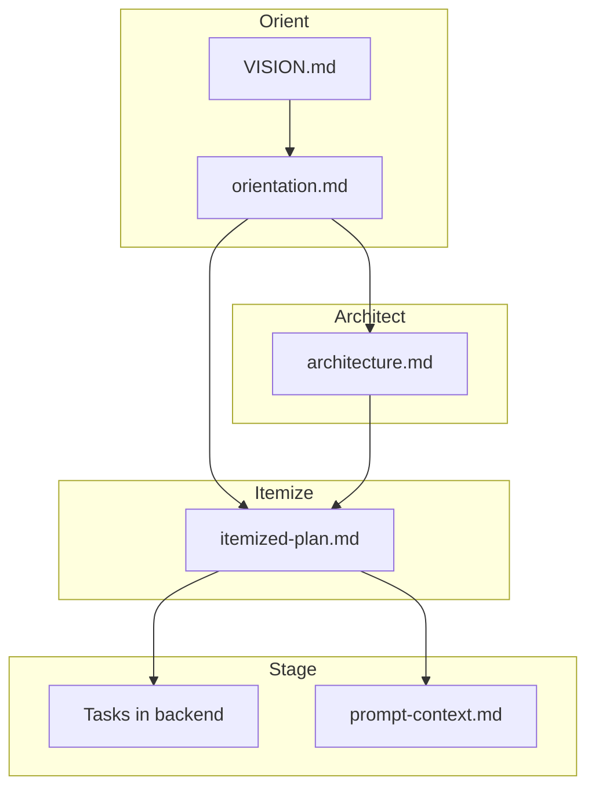

# Plan Flow

The plan flow transforms your ideas into structured, agent-ready tasks. It's a 4-stage guided process that refines requirements, designs architecture, decomposes work into tasks, and writes them to your task backend.

## What Plan Flow Does


| Stage | Purpose | Output |
|-------|---------|--------|
| [Orient](orient.md) | Clarify requirements and goals | `orientation.md` |
| [Architect](architect.md) | Design technical approach | `architecture.md` |
| [Itemize](itemize.md) | Break into agent-sized tasks | `itemized-plan.md` |
| [Stage](stage.md) | Write tasks to backend | Tasks in JSONL |

## The Full Pipeline

Run the entire plan flow with one command:

```bash
cub plan run
```

This launches each stage sequentially. After each stage completes, you can review outputs before proceeding to the next stage.

### Plan-Based Workflow

Plan flow stores artifacts in `plans/{slug}/`:

```
plans/myproject/
+-- orientation.md       # Refined requirements
+-- architecture.md      # Technical design
+-- itemized-plan.md     # Task decomposition
```

!!! tip "One Stage at a Time"
    Each stage gives you a natural checkpoint to review outputs before proceeding.

## Running Individual Stages

You can also run each stage independently:

```bash
cub plan orient             # Stage 1: Requirements refinement
cub plan architect          # Stage 2: Technical design
cub plan itemize            # Stage 3: Task decomposition
cub stage                   # Stage 4: Import tasks to backend
```

### Listing Plans

List your plans:

```bash
cub plan list             # List all plans
```

## When to Use Plan Flow vs Direct Task Creation

Use the plan flow when:

- Starting a new project or major feature
- You have a vision document but need to clarify requirements
- You want AI-assisted decomposition into right-sized tasks
- You need technical design before implementation

Create tasks directly when:

- Adding a small feature or bug fix
- Tasks are already well-defined
- Quick experiments or prototypes
- Integrating external issue tracking (GitHub Issues, Jira)

```bash
# Direct task creation with beads
bd create "Fix login bug" --type bugfix --priority 1

# Or import from external sources
cub import github://owner/repo/issues/123
```

## Non-Interactive Mode

For CI/CD or automated workflows, run the plan flow without interactive prompts:

```bash
cub plan run --non-interactive --vision VISION.md
```

!!! warning "Best-Effort Mode"
    Non-interactive mode makes best-effort assumptions when details are missing. Review outputs carefully or use interactive mode for important projects.

## Artifacts and Outputs

Each stage produces artifacts that feed into the next:



## Plan Status

After any stage, the plan flow shows your current progress:

```
PLAN STATUS
Plan: myproject

  [x] Orient    - orientation.md
  [x] Architect - architecture.md
  [ ] Itemize   - pending
  [ ] Stage     - pending

Next step: cub plan itemize
```

## Quick Reference

| Command | Description |
|---------|-------------|
| `cub plan run` | Run all stages sequentially |
| `cub plan run --non-interactive` | Automated mode (requires `--vision`) |
| `cub plan orient` | Run only orient stage |
| `cub plan architect` | Run only architect stage |
| `cub plan itemize` | Run only itemize stage |
| `cub stage` | Import tasks from completed plan |
| `cub plan list` | List all plans |

## Next Steps

<div class="grid cards" markdown>

-   :material-clipboard-check: **Orient**

    ---

    Start by clarifying your requirements and goals.

    [:octicons-arrow-right-24: Orient Stage](orient.md)

-   :material-sitemap: **Architect**

    ---

    Design your technical approach.

    [:octicons-arrow-right-24: Architect Stage](architect.md)

-   :material-format-list-numbered: **Itemize**

    ---

    Break work into agent-sized tasks.

    [:octicons-arrow-right-24: Itemize Stage](itemize.md)

-   :material-rocket-launch: **Stage**

    ---

    Import tasks to your backend.

    [:octicons-arrow-right-24: Stage](stage.md)

</div>
