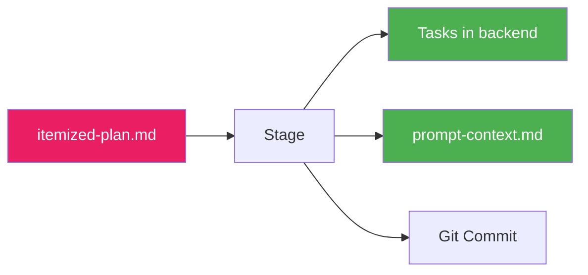

# Stage

Stage is the fourth and final step of the plan flow. It transitions from planning to execution by writing tasks to your task backend and preparing the project for `cub run`.

## What Stage Does

The stage step:

- Runs pre-flight checks (git, tools)
- Initializes the task backend
- Imports tasks from `itemized-plan.md`
- Wires up task dependencies
- Generates prompt context for runtime injection
- Creates a git commit



## Running Stage

### Standard Usage

```bash
cub stage
```

This uses the most recent plan with a completed itemize step.

### Dry Run

Preview what stage will do without making changes:

```bash
cub stage --dry-run
```

## Pre-Flight Checks

Stage verifies your environment before proceeding:

```
Running pre-flight checks...
  [check] Git repository found
  [check] Working directory clean
  [check] Task backend configured
```

### Check Details

| Check | Requirement | Fix |
|-------|-------------|-----|
| Git repository | Must be in a git repo | `git init` |
| Working directory | Ideally clean | Commit or stash changes |
| Task backend | Configured in `.cub/config.json` | Run `cub init` |

!!! warning "Uncommitted Changes"
    Stage warns about uncommitted changes but doesn't block. Consider committing before staging for a clean history.

## The Stage Process

### 1. Initialize Task Backend

If the task backend doesn't exist, stage initializes it.

If the backend is already initialized, stage adds to existing tasks.

### 2. Import Tasks

Tasks from `itemized-plan.md` are imported into the task backend.

### 3. Wire Dependencies

Dependencies are connected after import:

```
Wiring up dependencies...
  Added parent-child: proj-001 -> proj-E01
  Added parent-child: proj-002 -> proj-E01
  Added blocks: proj-003 -> proj-002
```

### 4. Generate Prompt Context

Stage creates a `prompt-context.md` file in the plan directory from orient and architect outputs. This context is injected at runtime when `cub run` executes tasks from this plan.

### 5. Git Commit

Stage creates a commit with all changes:

```
chore: stage tasks from cub plan

Plan: myproject
Imported: 3 epics, 15 tasks

Generated by: cub stage
```

## Output Summary

After stage completes:

```
Import complete:
  Epics: 3
  Tasks: 15
  Ready: 2

Generating prompt-context.md...
  Created prompt-context.md

Creating stage commit...

Planning is complete!

Next steps:
  1. Review tasks: cub task ready
  2. Start work: cub run
```

## Verifying the Import

After stage, verify your tasks:

```bash
# List all tasks
cub task list

# Show ready tasks (no blockers)
cub task ready

# Show task details
cub task show proj-001
```

## Existing Tasks

If you already have tasks in the backend:

```
Task backend already has 10 tasks.
Import will add to existing tasks.
```

Stage **adds** to existing tasks - it doesn't replace them. Task IDs from the plan are used as-is, so ensure your plan prefix doesn't conflict with existing task IDs.

## CLI Reference

```
Usage: cub stage [OPTIONS]

Stage 4: Transition to Execution

Options:
  --dry-run          Preview actions without executing
  -h, --help         Show this help message

Examples:
  cub stage                        # Stage most recent plan
  cub stage --dry-run              # Preview actions

Actions:
  1. Run pre-flight checks (git, tools)
  2. Initialize task backend (if needed)
  3. Import tasks from itemized-plan.md
  4. Wire up dependencies
  5. Generate prompt-context.md
  6. Create git commit
```

## After Stage

Your project is now ready for autonomous execution:

### Review Ready Tasks

```bash
$ cub task ready

ID          TYPE    PRI  TITLE
proj-001    task    P0   Initialize project structure
proj-002    task    P0   Configure logging
```

### Start the Run Loop

```bash
# Run all tasks
cub run

# Run a single task for testing
cub run --once

# Run with live output
cub run --stream
```

### Monitor Progress

```bash
# Check status
cub status

# Live monitoring dashboard
cub monitor
```

## Project Structure After Stage

```
my-project/
+-- plans/                        # Plan artifacts
|   +-- myproject/                # This plan
|       +-- orientation.md        # Refined requirements
|       +-- architecture.md       # Technical design
|       +-- itemized-plan.md      # Task decomposition
|       +-- prompt-context.md     # Runtime context for cub run
+-- .cub/                         # Cub runtime data
|   +-- config.json               # Project configuration
|   +-- hooks/                    # Project hooks
+-- CLAUDE.md                     # Build/run instructions
+-- ...                           # Your project files
```

## Troubleshooting

### "Not a git repository"

Initialize git first:

```bash
git init
```

### Import Failed

Check that `itemized-plan.md` is valid and contains properly formatted tasks.

## Next Steps

Planning is complete! You're ready to start autonomous execution.

<div class="grid cards" markdown>

-   :material-play: **Run the Loop**

    ---

    Start executing tasks with AI agents.

    ```bash
    cub run
    ```

    [:octicons-arrow-right-24: Run Loop Guide](../run-loop/index.md)

-   :material-format-list-checks: **Review Tasks**

    ---

    Check what's ready to execute.

    ```bash
    cub task ready
    ```

-   :material-monitor-dashboard: **Monitor Progress**

    ---

    Watch execution in real-time.

    ```bash
    cub monitor
    ```

-   :material-source-branch: **Create Branch**

    ---

    Bind a git branch to your epic.

    ```bash
    cub branch proj-E01
    ```

    [:octicons-arrow-right-24: Git Integration](../git/index.md)

</div>
