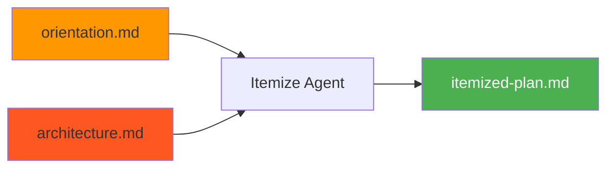
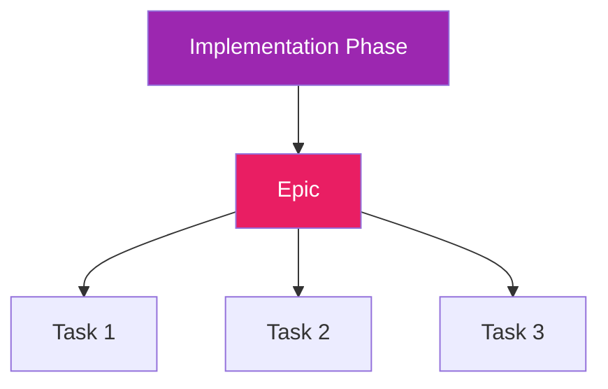

# Itemize Stage

Itemize is the third stage of the plan flow. It breaks down the architecture into executable tasks that an AI coding agent (or human) can pick up and complete in a single session.

## What Itemize Does

The itemize stage:

- Reviews orientation and architecture outputs
- Decomposes architecture into right-sized tasks
- Creates epics to group related tasks
- Assigns priorities and estimates
- Generates beads-compatible IDs



## Running Itemize

### Standard Usage

```bash
cub plan itemize
```

This uses the most recent plan with completed architect stage.

### Specify Plan

```bash
cub plan itemize my-feature
```

### As Part of Full Pipeline

```bash
cub plan run specs/researching/my-feature.md
```

!!! note "Requires Architect"
    Itemize requires a completed architect stage. Run `cub plan architect` first if needed.

## Task Sizing

For AI agent execution, itemize generates micro-sized tasks:

| Guideline | Target |
|-----------|--------|
| Duration | 15-30 minutes |
| Scope | One clear objective |
| Criteria | Explicit, verifiable |

!!! tip "When in Doubt, Split"
    If a task has multiple objectives, itemize splits it into smaller tasks.

## Task Decomposition

Itemize transforms architecture phases into a task hierarchy:



### Level 1: Epics

Each implementation phase from the architecture becomes an Epic - a container for related tasks.

### Level 2: Tasks

Each epic contains tasks that can be completed in one context window.

## Dependency Rules

Itemize automatically wires dependencies:

```
Infrastructure/setup tasks
        │
        ▼
Data models and schemas
        │
        ▼
Services that use the models
        │
        ▼
UI that calls the services
        │
        ▼
Tests (parallel or after implementation)
        │
        ▼
Documentation
```

## Vertical Slices

Itemize organizes for value delivery:

**Horizontal (avoided):**
```
Build all models → Build all services → Build all UI
```

**Vertical (preferred):**
```
Build User login (model + service + UI)
        │
        ▼
Build Dashboard (model + service + UI)
        │
        ▼
Build Settings (model + service + UI)
```

Each vertical slice is:

- **Demonstrable**: Something a user can see or interact with
- **Testable**: Can verify it works end-to-end
- **Valuable**: Delivers actual functionality

## Priority Levels

| Priority | Meaning | Examples |
|----------|---------|----------|
| **P0** | Critical path - blocks everything | Project setup, core schema |
| **P1** | Important - needed for core functionality | Auth, main features |
| **P2** | Standard - part of the plan but flexible | Secondary features |
| **P3** | Low - nice to have, can defer | Polish, optimization |

## Task Labels

Every task gets labels for filtering:

| Label Type | Values | Purpose |
|------------|--------|---------|
| **Phase** | `phase-1`, `phase-2`, etc. | Implementation phase |
| **Complexity** | `high`, `medium`, `low` | Effort indicator |
| **Type** | `setup`, `model`, `api`, `ui`, `test` | Domain category |

## Task Structure

Each task includes:

```markdown
## Context
Why this task exists and how it fits the bigger picture.

## Implementation Steps
1. Concrete step 1
2. Concrete step 2
3. Concrete step 3

## Acceptance Criteria
- [ ] Specific, verifiable criterion
- [ ] Specific, verifiable criterion

## Files Likely Involved
- path/to/file.ext
```

## Output: itemized-plan.md

Itemize produces `plans/{slug}/itemized-plan.md`:

```markdown
# Itemized Plan: User Authentication

## Summary
- Epics: 3
- Tasks: 12
- Estimated effort: 2 days

---

## Epic: E01 - Foundation
Priority: P0
Labels: phase-1, setup

Set up project foundation and authentication infrastructure.

### Task: 001 - Initialize project structure
Priority: P0
Labels: phase-1, setup, low

Create directory structure and basic configuration.

#### Context
Foundation task that enables all other work.

#### Implementation Steps
1. Create src/ directory structure
2. Add pyproject.toml with dependencies
3. Configure logging

#### Acceptance Criteria
- [ ] Project structure matches architecture
- [ ] Dependencies install cleanly

---

### Task: 002 - Create user model
Priority: P0
Labels: phase-1, model, medium

Define the User model and database migrations.

#### Context
User model is required for authentication.

...
```

## Example Summary

After itemizing, you'll see:

```
Itemize complete!

Summary:
  Epics: 3
  Tasks: 12
  Epic IDs:
    - E01: Foundation (4 tasks)
    - E02: Core Auth (5 tasks)
    - E03: OAuth Integration (3 tasks)

Next step: cub stage
```

## CLI Reference

```
Usage: cub plan itemize [OPTIONS] [PLAN_SLUG]

Break down the architecture into actionable tasks.

Arguments:
  PLAN_SLUG              Plan slug to itemize (default: most recent)

Options:
  --spec TEXT            Find plan by spec name
  --project-root PATH    Project root directory
  -v, --verbose          Show detailed output
  -h, --help             Show this help message

Examples:
  cub plan itemize
  cub plan itemize my-feature
  cub plan itemize --spec auth-feature
```

## Principles

!!! tip "Right-Sized Tasks"
    Completable in one focused session. If it feels too big, split it.

!!! tip "Clear Boundaries"
    One objective per task. Multiple objectives = multiple tasks.

!!! tip "Explicit Dependencies"
    Don't assume the agent will figure out the order. Wire dependencies explicitly.

!!! tip "Actionable Descriptions"
    Someone should be able to start immediately with the information provided.

!!! tip "Verifiable Completion"
    Acceptance criteria should be checkable - tests pass, file exists, API responds.

!!! tip "Context is Cheap"
    Include relevant context. Agents don't remember previous tasks.

## Next Step

Once itemize is complete, import tasks to your backend:

```bash
cub stage
```

[:octicons-arrow-right-24: Stage](stage.md)
