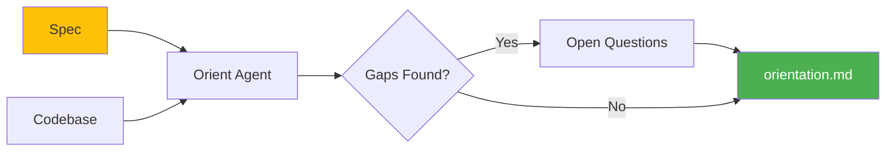

# Orient Stage

Orient is the first stage of the plan flow. It researches and understands the problem space before any technical work begins.

## What Orient Does

The orient stage:

- Reviews your spec document (or vision/PRD)
- Analyzes the existing codebase for context
- Identifies requirements, constraints, and risks
- Surfaces open questions that need answers



## Running Orient

### From a Spec

```bash
cub plan orient specs/researching/my-feature.md
```

### With Options

```bash
cub plan orient my-feature.md --depth deep --slug custom-name
```

### As Part of Full Pipeline

```bash
cub plan run specs/researching/my-feature.md
```

## Orient Depth

Control how thorough the research should be:

| Depth | Description | Use Case |
|-------|-------------|----------|
| `light` | Quick coherence check | Prototypes, experiments |
| `standard` | Full problem analysis (default) | Most features |
| `deep` | Include feasibility analysis | Major initiatives |

```bash
cub plan orient my-feature.md --depth deep
```

## What Orient Produces

Orient creates `plans/{slug}/orientation.md` with:

### Problem Statement

Clear articulation of what problem is being solved and who has it.

### Requirements

Prioritized requirements extracted and refined from the spec:

- **P0 - Must Have**: Critical for MVP
- **P1 - Should Have**: Important but not blocking
- **P2 - Nice to Have**: Can defer

### Constraints

Technical, timeline, or business constraints that affect the solution.

### Open Questions

Things that need answers before proceeding:

```markdown
## Open Questions

1. What authentication method should be used?
2. Is there a rate limit requirement for the API?
3. What's the expected data volume?
```

### Risks

Identified risks with potential mitigations:

| Risk | Impact | Mitigation |
|------|--------|------------|
| Third-party API changes | High | Abstract integration layer |
| Scale issues | Medium | Design for horizontal scaling |

## Example Output

```markdown
# Orientation: User Authentication

**Date:** 2026-01-20
**Depth:** standard
**Status:** Complete

---

## Problem Statement

Users need a secure way to authenticate that works across
web and mobile platforms while minimizing friction.

## Requirements

### P0 - Must Have
- Email/password authentication
- Session management with secure tokens
- Password reset flow

### P1 - Should Have
- OAuth providers (Google, GitHub)
- Remember me functionality

### P2 - Nice to Have
- Magic link authentication
- 2FA support

## Constraints

- Must work with existing user database schema
- Session timeout max 24 hours per security policy
- Mobile app uses React Native

## Open Questions

1. Should we support enterprise SSO (SAML)?
2. What's the password complexity requirement?

## Risks

| Risk | Impact | Mitigation |
|------|--------|------------|
| OAuth provider outage | M | Support multiple providers |
| Token theft | H | Short expiry + refresh tokens |

---

**Next Step:** Run `cub plan architect` to proceed to technical design.
```

## Vision Document Discovery

If no spec is provided, orient looks for documents in this order:

1. **VISION.md** in project root
2. **docs/PRD.md** - Product requirements document
3. **docs/VISION.md** - Alternative location
4. **README.md** - Only if substantial (>500 chars)

## CLI Reference

```
Usage: cub plan orient [OPTIONS] [SPEC]

Research and understand the problem space.

Arguments:
  SPEC                   Spec ID or path to orient from

Options:
  --depth TEXT          Orient depth: light, standard, or deep
  --slug TEXT           Explicit plan slug (default: derived from spec)
  --project-root PATH   Project root directory
  -v, --verbose         Show detailed output
  -h, --help            Show this help message

Examples:
  cub plan orient spec.md
  cub plan orient specs/researching/auth.md --depth deep
  cub plan orient auth.md --slug user-auth
```

## Principles

!!! tip "Understand Before Designing"
    Orient's job is to fully understand the problem before jumping to solutions.

!!! tip "Surface Unknowns"
    Explicitly document open questions rather than making assumptions.

!!! tip "Be Direct About Risks"
    Identify what could go wrong early, when it's cheap to address.

!!! tip "Stay Problem-Focused"
    Technical solutions belong to the Architect phase.

## Next Step

Once orient is complete, proceed to technical design:

```bash
cub plan architect
```

[:octicons-arrow-right-24: Architect Stage](architect.md)
