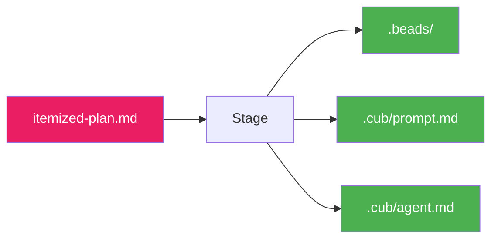

# Stage

Stage is the bridge between planning and execution. It imports tasks from a completed plan into your task backend, making them ready for `cub run`.

## What Stage Does

The stage command:

- Runs pre-flight checks (git, required tools)
- Parses the itemized plan
- Creates epics and tasks in beads
- Generates context files for agents
- Moves specs through the lifecycle



## Running Stage

### Standard Usage

```bash
cub stage
```

This stages the most recent complete plan.

### Specify Plan

```bash
cub stage my-feature
```

### Dry Run

Preview what would be imported:

```bash
cub stage --dry-run
```

### List Stageable Plans

```bash
cub stage --list
```

## Pre-Flight Checks

Stage verifies your environment before proceeding:

```
Running pre-flight checks...
  ✓ Git repository found
  ✓ Working directory clean
  ✓ Beads CLI (bd) found
  ℹ Beads already initialized with 10 issues
```

### Check Details

| Check | Requirement | Fix |
|-------|-------------|-----|
| Git repository | Must be in a git repo | `git init` |
| Working directory | Ideally clean | Commit or stash |
| Beads CLI | `bd` command available | Install beads |

!!! warning "Uncommitted Changes"
    Stage warns about uncommitted changes but doesn't block. Consider committing before staging for a clean history.

## The Staging Process

### 1. Parse Itemized Plan

Stage reads `plans/{slug}/itemized-plan.md` and extracts epics and tasks.

### 2. Create in Beads

Epics and tasks are created via the beads CLI:

```bash
bd create "Epic: Foundation" --type epic --priority 0
bd create "Task: Initialize project" --type task --parent E01
```

### 3. Wire Dependencies

Dependencies between tasks are connected.

### 4. Generate Context Files

**`.cub/prompt.md`** - Project context for AI agents:

Extracts key sections from orientation and architecture:
- Problem statement
- Requirements (P0/P1)
- Technical approach
- Components
- Constraints

**`.cub/agent.md`** - Build/run instructions (template if none exists):

```markdown
# Agent Instructions

## Project Overview
<!-- Brief description -->

## Tech Stack
- **Language**:
- **Framework**:

## Development Setup
\`\`\`bash
# Setup commands
\`\`\`

## Feedback Loops
\`\`\`bash
# Tests, linting, type checking
\`\`\`
```

### 5. Move Spec

On successful staging, the spec moves from `planned/` to `staged/`:

```
specs/planned/my-feature.md → specs/staged/my-feature.md
```

## Output Summary

After staging completes:

```
Staging complete!
Duration: 2.3s

Created: 3 epics, 12 tasks
Spec moved to: specs/staged/my-feature.md
Generated: .cub/prompt.md, .cub/agent.md

Next step: cub run
```

## Verifying the Import

After staging, verify your tasks:

```bash
# List all tasks
bd list

# Show ready tasks (no blockers)
bd ready

# Show task details
bd show auth-001
```

## Existing Beads State

If beads is already initialized:

```
ℹ Beads already initialized with 10 issues.
  Import will add to existing issues.
```

Stage **adds** to existing tasks - it doesn't replace them.

## Options Reference

| Option | Description |
|--------|-------------|
| `--dry-run`, `-n` | Preview without importing |
| `--list`, `-l` | List all stageable plans |
| `--verbose`, `-v` | Show detailed output |
| `--skip-checks` | Skip pre-flight checks |
| `--skip-prompt` | Don't generate prompt/agent files |
| `--project-root` | Project root directory |

## CLI Reference

```
Usage: cub stage [OPTIONS] [PLAN_SLUG]

Import tasks from a completed plan into the task backend.

Arguments:
  PLAN_SLUG              Plan slug to stage (default: most recent complete)

Options:
  -n, --dry-run          Preview without importing
  -l, --list             List all stageable plans
  -v, --verbose          Show detailed output
  --skip-checks          Skip pre-flight checks
  --skip-prompt          Don't generate prompt.md and agent.md
  --project-root PATH    Project root directory
  -h, --help             Show this help message

Examples:
  cub stage                    # Stage most recent plan
  cub stage my-feature         # Stage specific plan
  cub stage --dry-run          # Preview actions
  cub stage --list             # List stageable plans
```

## Troubleshooting

### "No stageable plans found"

Plans must be complete (all three stages done) to be staged:

```bash
cub plan list --verbose  # Check stage status
```

### "Beads CLI not found"

Install the beads CLI:

```bash
pip install beads
```

### "Plan already staged"

A plan can only be staged once. The tasks already exist in beads.

## After Staging

Your project is now ready for autonomous execution:

### Review Ready Tasks

```bash
$ bd ready

ID          TYPE    PRI  TITLE
auth-001    task    P0   Initialize project structure
auth-002    task    P0   Configure logging
```

### Start the Run Loop

```bash
# Run all tasks
cub run

# Run a single task for testing
cub run --once

# Run with live output
cub run --stream
```

### Monitor Progress

```bash
# Check status
cub status

# Live monitoring dashboard
cub monitor
```

## Project Structure After Staging

```
my-project/
├── .beads/                  # Task database
│   ├── issues.jsonl         # All tasks
│   └── branches.yaml        # Branch bindings
├── .cub/                    # Cub runtime data
│   ├── prompt.md            # Project context for AI
│   └── agent.md             # Build/run instructions
├── plans/                   # Plan artifacts
│   └── my-feature/
│       ├── plan.json
│       ├── orientation.md
│       ├── architecture.md
│       └── itemized-plan.md
├── specs/
│   └── staged/
│       └── my-feature.md    # Spec moved here
└── ...                      # Your project files
```

## Next Steps

Staging is complete! You're ready to start autonomous execution.

<div class="grid cards" markdown>

-   :material-play: **Run the Loop**

    ---

    Start executing tasks with AI agents.

    ```bash
    cub run
    ```

    [:octicons-arrow-right-24: Run Loop Guide](../run-loop/index.md)

-   :material-format-list-checks: **Review Tasks**

    ---

    Check what's ready to execute.

    ```bash
    bd ready
    ```

-   :material-monitor-dashboard: **Monitor Progress**

    ---

    Watch execution in real-time.

    ```bash
    cub monitor
    ```

-   :material-source-branch: **Create Branch**

    ---

    Bind a git branch to your epic.

    ```bash
    cub branch auth-E01
    ```

    [:octicons-arrow-right-24: Git Integration](../git/index.md)

</div>
