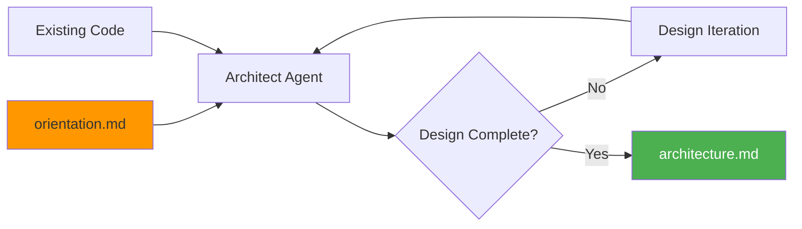

# Architect Stage

Architect is the second stage of the plan flow. It translates the oriented requirements into a technical design that balances project needs with pragmatic engineering decisions.

## What Architect Does

The architect stage:

- Reviews the orientation output for requirements context
- Explores existing codebase patterns and conventions
- Proposes system structure and components
- Documents technology choices and trade-offs



## Running Architect

### Standard Usage

```bash
cub plan architect
```

This uses the most recent plan with completed orient stage.

### Specify Plan

```bash
cub plan architect my-feature
```

### With Options

```bash
cub plan architect --mindset production --scale product
```

### As Part of Full Pipeline

```bash
cub plan run specs/researching/my-feature.md
```

## Technical Mindset

The mindset controls how the architect approaches the design:

| Mindset | Description | Characteristics |
|---------|-------------|-----------------|
| `prototype` | Speed over quality | Minimal structure, shortcuts OK |
| `mvp` | Balance speed and quality (default) | Clean code, tests for critical paths |
| `production` | Quality-first | Comprehensive tests, good observability |
| `enterprise` | Maximum rigor | Security, compliance, audit trails |

```bash
cub plan architect --mindset production
```

## Scale Expectations

Scale affects infrastructure and architecture choices:

| Scale | Description | Design Implications |
|-------|-------------|---------------------|
| `personal` | Just you (1 user) | SQLite, simple deployment |
| `team` | Your team (10-100 users, default) | PostgreSQL, basic monitoring |
| `product` | Public product (1,000+ users) | Caching, CDN, proper infra |
| `internet-scale` | Millions of users | HA, sharding, observability |

```bash
cub plan architect --scale product
```

## How Mindset Shapes Design

### Prototype Mindset

```
├── Single file or minimal structure
├── SQLite, JSON files, or in-memory
├── Skip tests if faster
├── Hardcode what you can
└── Monolith everything
```

### MVP Mindset

```
├── Clean separation of concerns
├── SQLite or PostgreSQL
├── Tests for critical paths
├── Basic error handling
└── Monolith with clear module boundaries
```

### Production Mindset

```
├── Well-defined component architecture
├── Proper database for scale
├── Comprehensive test coverage
├── Proper error handling and logging
└── API versioning if external-facing
```

### Enterprise Mindset

```
├── Formal architecture documentation
├── Security-first design (auth, encryption, audit)
├── Compliance considerations
├── High availability and disaster recovery
└── Monitoring, alerting, observability
```

## What Architect Produces

Architect creates `plans/{slug}/architecture.md` with:

### Technical Summary

High-level overview of the architecture and key decisions.

### Technology Stack

Specific choices with rationale:

| Layer | Choice | Rationale |
|-------|--------|-----------|
| Language | Python 3.11 | Team familiarity |
| Framework | FastAPI | Async, OpenAPI |
| Database | PostgreSQL | ACID, JSON support |

### Components

Major modules/services and their responsibilities:

```markdown
### API Gateway
- **Purpose:** Handle HTTP requests, authentication, routing
- **Responsibilities:** Request validation, JWT auth, rate limiting
- **Dependencies:** Auth service, business logic services

### Business Logic
- **Purpose:** Core application logic
- **Responsibilities:** Domain operations, validation
- **Interface:** Internal Python modules
```

### Data Model

Key entities and relationships:

```markdown
### User
- id: UUID - Primary key
- email: String - Unique
- created_at: DateTime

### Relationships
- User -> Habits: One-to-many
```

### Implementation Phases

Logical order to build things:

```markdown
### Phase 1: Foundation
- Project setup and configuration
- Database schema and migrations
- Authentication flow

### Phase 2: Core Features
- Main feature implementation
- API endpoints
- Basic UI
```

## Example Output

```markdown
# Architecture: User Authentication

**Date:** 2026-01-20
**Mindset:** mvp
**Scale:** team
**Status:** Complete

---

## Technical Summary

Implementing OAuth-first authentication with email/password fallback.
Using JWT tokens with short expiry and refresh token rotation.

## Technology Stack

| Layer | Choice | Rationale |
|-------|--------|-----------|
| Auth | JWT + OAuth | Standard, stateless |
| Storage | PostgreSQL | Existing infra |
| Cache | Redis | Token blacklist |

## System Architecture

┌─────────────────┐
│   Web Client    │
└────────┬────────┘
         │
┌────────▼────────┐
│   API Gateway   │
│   (FastAPI)     │
└────────┬────────┘
         │
┌────────▼────────┐
│  Auth Service   │
└────────┬────────┘
         │
┌────────▼────────┐
│   PostgreSQL    │
└─────────────────┘

## Components

### Auth Service
- Purpose: Handle all authentication flows
- Responsibilities: Login, logout, token refresh, OAuth
- Interface: REST API

## Implementation Phases

### Phase 1: Foundation
- User model and migrations
- JWT token generation
- Login/logout endpoints

### Phase 2: OAuth
- OAuth provider integration
- Account linking

---

**Next Step:** Run `cub plan itemize` to generate tasks.
```

## Existing Project Analysis

When extending an existing project, architect respects:

- Directory structure and organization
- Coding conventions (from CLAUDE.md)
- Technology choices already in use
- Established patterns and abstractions

## CLI Reference

```
Usage: cub plan architect [OPTIONS] [PLAN_SLUG]

Design the solution architecture.

Arguments:
  PLAN_SLUG              Plan slug to continue (default: most recent)

Options:
  --spec TEXT            Find plan by spec name
  --mindset TEXT         Technical mindset: prototype, mvp, production, enterprise
  --scale TEXT           Expected scale: personal, team, product, internet-scale
  --project-root PATH    Project root directory
  -v, --verbose          Show detailed output
  -h, --help             Show this help message

Examples:
  cub plan architect
  cub plan architect my-feature
  cub plan architect --mindset production --scale product
```

## Principles

!!! tip "Right-Size the Solution"
    A prototype doesn't need microservices; an enterprise system needs more than SQLite.

!!! tip "Justify Choices"
    Every technology choice should have a reason tied to requirements.

!!! tip "Acknowledge Trade-offs"
    Be explicit about what you're trading off and why.

!!! tip "Stay Practical"
    Recommend what will actually work, not what's theoretically ideal.

!!! tip "Consider the Builder"
    The Itemize stage will turn this into tasks - make sure the design is actionable.

## Next Step

Once architecture is complete, proceed to task decomposition:

```bash
cub plan itemize
```

[:octicons-arrow-right-24: Itemize Stage](itemize.md)
