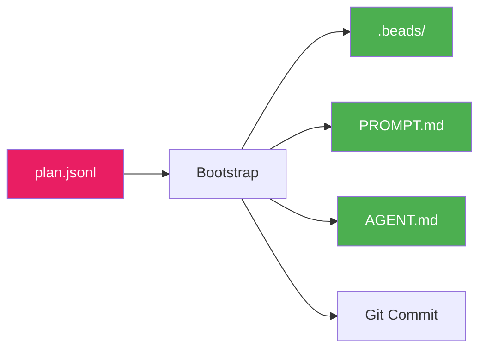

# Bootstrap Stage

Bootstrap is the fourth and final stage of the prep pipeline. It transitions from planning to execution by writing tasks to your task backend and preparing the project for `cub run`.

## What Bootstrap Does

The bootstrap stage:

- Runs pre-flight checks (git, tools)
- Initializes the task backend (Beads)
- Imports tasks from `plan.jsonl`
- Wires up task dependencies
- Generates project prompt files
- Creates a git commit



## Running Bootstrap

### Standard Usage

```bash
cub bootstrap
```

This uses the most recent session with a completed plan.

### Specify Session

```bash
cub bootstrap myproject-20260117-143022
```

### Dry Run

Preview what bootstrap will do without making changes:

```bash
cub bootstrap --dry-run
```

### Custom Prefix

Override the task ID prefix:

```bash
cub bootstrap --prefix myproj
```

### Skip Prompt Generation

If you already have PROMPT.md and AGENT.md:

```bash
cub bootstrap --skip-prompt
```

## Pre-Flight Checks

Bootstrap verifies your environment before proceeding:

```
Running pre-flight checks...
  [check] Git repository found
  [check] Working directory clean
  [check] Beads CLI found
  [check] jq found
```

### Check Details

| Check | Requirement | Fix |
|-------|-------------|-----|
| Git repository | Must be in a git repo | `git init` |
| Working directory | Ideally clean | Commit or stash changes |
| Beads CLI | `bd` command available | Install from beads repo |
| jq | JSON processor available | `brew install jq` |

!!! warning "Uncommitted Changes"
    Bootstrap warns about uncommitted changes but doesn't block. Consider committing before bootstrap for a clean history.

## The Bootstrap Process

### 1. Initialize Beads

If `.beads/` doesn't exist, bootstrap initializes it:

```bash
bd init
# or with custom prefix
bd init --prefix myproj
```

If beads is already initialized, bootstrap adds to existing tasks.

### 2. Import Tasks

Tasks from `plan.jsonl` are imported:

```bash
bd import -i plan.jsonl
```

This creates all epics and tasks in your beads database.

### 3. Wire Dependencies

Dependencies are connected after import:

```
Wiring up dependencies...
  Added parent-child: proj-001 -> proj-E01
  Added parent-child: proj-002 -> proj-E01
  Added blocks: proj-003 -> proj-002
```

### 4. Sync State

Beads state is synchronized:

```bash
bd sync
```

### 5. Generate Project Files

Bootstrap creates prompt files from triage and architect outputs:

**PROMPT.md** - Project context for AI agents:
```markdown
# Project Prompt

## Overview
Summary from triage...

## Problem Statement
From triage...

## Technical Approach
From architect...

## Architecture
From architect...

## Requirements
P0 requirements from triage...

## Constraints
From triage...
```

**AGENT.md** - Build/run instructions (template if none exists):
```markdown
# Agent Instructions

## Project Overview
<!-- Brief description -->

## Tech Stack
- **Language**:
- **Framework**:

## Development Setup
```bash
# Setup commands
```

## Running the Project
```bash
# Run commands
```

## Feedback Loops
```bash
# Tests, type checking, linting
```
```

### 6. Git Commit

Bootstrap creates a commit with all changes:

```
chore: bootstrap beads from cub prep

Session: myproject-20260117-143022
Imported: 3 epics, 15 tasks

Generated by: cub bootstrap
```

## Output Summary

After bootstrap completes:

```
Import complete:
  Epics: 3
  Tasks: 15
  Ready: 2

Generating prompt.md and agent.md...
  Created prompt.md
  Created agent.md

Creating bootstrap commit...

Bootstrap complete!

Next steps:
  1. Review tasks: bd ready
  2. Start work: cub run
```

## Verifying the Import

After bootstrap, verify your tasks:

```bash
# List all tasks
bd list

# Show ready tasks (no blockers)
bd ready

# Show task details
bd show proj-001

# Check dependencies
bd dep show proj-001
```

## Choosing a Backend

Bootstrap currently uses **Beads** as the task backend. Beads provides:

- Rich task management via CLI
- Epic and dependency support
- Labels for filtering and model selection
- Branch-epic bindings

!!! info "JSON Backend"
    For simpler projects, Cub also supports a JSON backend (`prd.json`). However, bootstrap currently targets Beads. For JSON backend, manually create `prd.json` from the plan.

## Existing Beads State

If you already have beads initialized:

```
Beads already initialized with 10 issues.
Import will add to existing issues.
```

Bootstrap **adds** to existing tasks - it doesn't replace them. Task IDs from the plan are used as-is, so ensure your plan prefix doesn't conflict with existing task IDs.

## CLI Reference

```
Usage: cub bootstrap [OPTIONS] [SESSION_ID]

Stage 4: Transition to Execution

Arguments:
  SESSION_ID         Session ID from plan (default: most recent)

Options:
  --prefix PREFIX    Beads prefix for issue IDs
  --skip-prompt      Don't generate PROMPT.md and AGENT.md
  --dry-run          Preview actions without executing
  -h, --help         Show this help message

Examples:
  cub bootstrap                    # Bootstrap most recent session
  cub bootstrap --dry-run          # Preview actions
  cub bootstrap --prefix myproj    # Use custom prefix

Actions:
  1. Run pre-flight checks (git, tools)
  2. Initialize beads (if needed)
  3. Import plan.jsonl
  4. Wire up dependencies
  5. Generate PROMPT.md and AGENT.md
  6. Create git commit
```

## After Bootstrap

Your project is now ready for autonomous execution:

### Review Ready Tasks

```bash
$ bd ready

ID          TYPE    PRI  TITLE
proj-001    task    P0   Initialize project structure
proj-002    task    P0   Configure logging
```

### Start the Run Loop

```bash
# Run all tasks
cub run

# Run a single task for testing
cub run --once

# Run with live output
cub run --stream
```

### Monitor Progress

```bash
# Check status
cub status

# Live monitoring dashboard
cub monitor
```

## Project Structure After Bootstrap

```
my-project/
+-- .beads/                  # Task database
|   +-- issues.jsonl         # All tasks
|   +-- branches.yaml        # Branch bindings
+-- .cub/                    # Cub runtime data
|   +-- sessions/            # Prep sessions
|   |   +-- myproject-.../   # This session
|   |       +-- triage.md
|   |       +-- architect.md
|   |       +-- plan.jsonl
|   |       +-- plan.md
|   |       +-- session.json
|   +-- hooks/               # Project hooks
+-- PROMPT.md                # Project context for AI
+-- AGENT.md                 # Build/run instructions
+-- ...                      # Your project files
```

## Troubleshooting

### "Beads CLI not found"

Install the beads CLI:

```bash
# From the beads repository
pip install beads
```

### "Not a git repository"

Initialize git first:

```bash
git init
```

### Import Failed

Check that `plan.jsonl` is valid:

```bash
# Validate JSON
jq -c . .cub/sessions/*/plan.jsonl

# Check for required fields
jq 'select(.id and .title)' .cub/sessions/*/plan.jsonl
```

### Dependency Wiring Errors

Dependencies reference task IDs. Ensure all referenced IDs exist:

```bash
# Find dependency references
jq '.dependencies[].depends_on_id' .cub/sessions/*/plan.jsonl
```

## Next Steps

Prep is complete! You're ready to start autonomous execution.

<div class="grid cards" markdown>

-   :material-play: **Run the Loop**

    ---

    Start executing tasks with AI agents.

    ```bash
    cub run
    ```

    [:octicons-arrow-right-24: Run Loop Guide](../run-loop/index.md)

-   :material-format-list-checks: **Review Tasks**

    ---

    Check what's ready to execute.

    ```bash
    bd ready
    ```

-   :material-monitor-dashboard: **Monitor Progress**

    ---

    Watch execution in real-time.

    ```bash
    cub monitor
    ```

-   :material-source-branch: **Create Branch**

    ---

    Bind a git branch to your epic.

    ```bash
    cub branch proj-E01
    ```

    [:octicons-arrow-right-24: Git Integration](../git/index.md)

</div>
