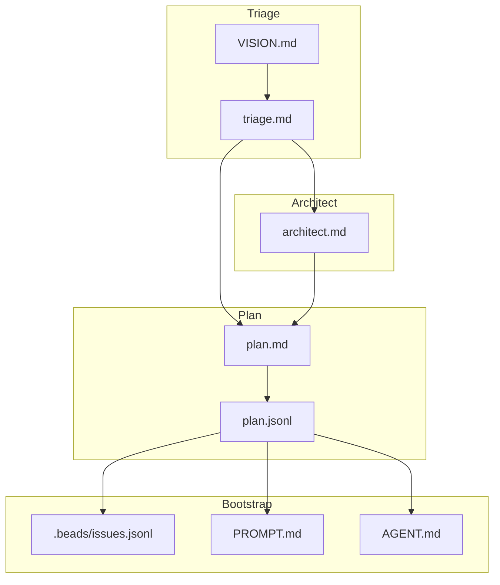

# Prep Pipeline

The prep pipeline transforms your ideas into structured, agent-ready tasks. It's a 4-stage guided process that refines requirements, designs architecture, decomposes work into tasks, and writes them to your task backend.

## What Prep Does


| Stage | Purpose | Output |
|-------|---------|--------|
| [Triage](triage.md) | Clarify requirements and goals | `triage.md` |
| [Architect](architect.md) | Design technical approach | `architect.md` |
| [Plan](plan.md) | Break into agent-sized tasks | `plan.jsonl`, `plan.md` |
| [Bootstrap](bootstrap.md) | Write tasks to backend | Tasks in Beads/JSON |

## The Full Pipeline

Run the entire prep pipeline with one command:

```bash
cub prep
```

This launches an interactive session for each stage sequentially. After each stage completes, run `cub prep` again to continue to the next stage.

### Session-Based Workflow

Prep uses **sessions** to track your progress through the pipeline. Each session stores artifacts in `.cub/sessions/{session-id}/`:

```
.cub/sessions/myproject-20260117-143022/
+-- session.json     # Session metadata
+-- triage.md        # Refined requirements
+-- architect.md     # Technical design
+-- plan.jsonl       # Beads-compatible task data
+-- plan.md          # Human-readable plan
```

!!! tip "One Stage at a Time"
    Each `cub prep` invocation runs one stage. This gives you a natural checkpoint to review outputs before proceeding.

## Running Individual Stages

You can also run each stage independently:

```bash
cub triage                  # Stage 1: Requirements refinement
cub architect               # Stage 2: Technical design
cub plan                    # Stage 3: Task decomposition
cub bootstrap               # Stage 4: Initialize tasks
```

### Resuming a Session

Resume a specific session:

```bash
cub prep --session myproject-20260117-143022

# Or continue the most recent session
cub prep --continue
```

### Managing Sessions

List and manage your prep sessions:

```bash
cub sessions              # List all sessions
cub sessions show         # Show most recent session details
cub sessions delete ID    # Delete a session
```

## When to Use Prep vs Direct Task Creation

Use the prep pipeline when:

- Starting a new project or major feature
- You have a vision document but need to clarify requirements
- You want AI-assisted decomposition into right-sized tasks
- You need technical design before implementation

Create tasks directly when:

- Adding a small feature or bug fix
- Tasks are already well-defined
- Quick experiments or prototypes
- Integrating external issue tracking (GitHub Issues, Jira)

```bash
# Direct task creation with beads
bd create "Fix login bug" --type bugfix --priority 1

# Or import from external sources
cub import github://owner/repo/issues/123
```

## Non-Interactive Mode

For CI/CD or automated workflows, run prep without interactive prompts:

```bash
cub prep --non-interactive --vision VISION.md
```

!!! warning "Best-Effort Mode"
    Non-interactive mode makes best-effort assumptions when details are missing. Review outputs carefully or use interactive mode for important projects.

## Artifacts and Outputs

Each stage produces artifacts that feed into the next:



## Prep Status

After any stage, prep shows your current progress:

```
PREP STATUS
Session: myproject-20260117-143022

  [x] Triage    - triage.md
  [x] Architect - architect.md
  [ ] Plan      - pending
  [ ] Bootstrap - pending

Next step: cub plan --session myproject-20260117-143022
```

## Quick Reference

| Command | Description |
|---------|-------------|
| `cub prep` | Run next incomplete stage |
| `cub prep --continue` | Continue most recent session |
| `cub prep --session ID` | Resume specific session |
| `cub prep --non-interactive` | Automated mode (requires `--vision`) |
| `cub triage` | Run only triage stage |
| `cub architect` | Run only architect stage |
| `cub plan` | Run only plan stage |
| `cub bootstrap` | Run only bootstrap stage |
| `cub sessions` | List all sessions |

## Next Steps

<div class="grid cards" markdown>

-   :material-clipboard-check: **Triage**

    ---

    Start by clarifying your requirements and goals.

    [:octicons-arrow-right-24: Triage Stage](triage.md)

-   :material-sitemap: **Architect**

    ---

    Design your technical approach.

    [:octicons-arrow-right-24: Architect Stage](architect.md)

-   :material-format-list-numbered: **Plan**

    ---

    Break work into agent-sized tasks.

    [:octicons-arrow-right-24: Plan Stage](plan.md)

-   :material-rocket-launch: **Bootstrap**

    ---

    Initialize your task backend.

    [:octicons-arrow-right-24: Bootstrap Stage](bootstrap.md)

</div>
