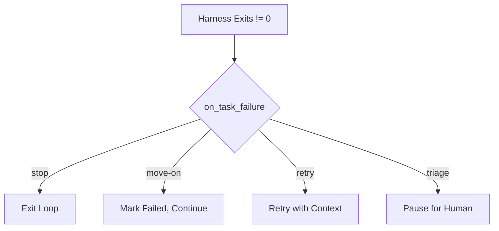

# Task Completion

Task completion is how the AI signals that work is finished. Cub verifies completion through status changes, clean state checks, and optional auto-close behavior.

## How Tasks Are Completed

The AI agent completes a task by:

1. **Doing the work**: Implementing the feature, fixing the bug, etc.
2. **Running feedback loops**: Tests, type checks, linting
3. **Closing the task**: Using the backend-specific command
4. **Committing changes**: Clean git state

### Completion via Backend

=== "Beads Backend"

    ```bash
    # AI runs this command when done
    bd close cub-042 -r "Implemented with all tests passing"
    ```

    The `-r` flag adds a closing reason.

=== "JSON Backend"

    The AI edits `prd.json` directly:

    ```json
    {
      "id": "myproj-042",
      "title": "Add feature X",
      "status": "closed"  // Changed from "open"
    }
    ```

## The Completion Signal

When cub generates the task prompt, it includes completion instructions:

```
When complete:
1. Run feedback loops (typecheck, test, lint)
2. Mark task complete: bd close cub-042
3. Commit: feature(cub-042): Add user authentication
4. Append learnings to progress.txt
```

The AI follows these steps and the harness exit code indicates success or failure.

## Clean State Verification

After the harness completes, cub optionally verifies clean state:

### Git Commit Check

When `clean_state.require_commit` is `true`:

```bash
# Cub runs this check
git status --porcelain
```

If uncommitted changes exist:

- **With auto_commit enabled**: Cub commits them automatically
- **With auto_commit disabled**: Task marked incomplete

### Test Verification

When `clean_state.require_tests` is `true`:

Cub runs the project's test command and verifies exit code 0.

### Configuration

```json
{
  "clean_state": {
    "require_commit": true,
    "require_tests": false,
    "auto_commit": true
  }
}
```

## Auto-Close Feature

Sometimes the AI completes all work but forgets to close the task. The `task.auto_close` setting handles this:

```json
{
  "task": {
    "auto_close": true
  }
}
```

When enabled:

1. Harness exits with code 0 (success)
2. Cub checks if task status is still `open` or `in_progress`
3. If so, cub closes it automatically

### Backend Behavior

| Backend | Auto-Close Action |
|---------|-------------------|
| Beads | Runs `bd close <task-id>` |
| JSON | Updates status to `"closed"` in `prd.json` |

### Disabling Auto-Close

For strict workflows where explicit AI closure is required:

```json
{
  "task": {
    "auto_close": false
  }
}
```

With this setting, tasks remain `in_progress` if the AI doesn't explicitly close them.

## Completion States

After execution, a task ends up in one of these states:

| State | Meaning | Next Action |
|-------|---------|-------------|
| `closed` | Successfully completed | Move to next task |
| `in_progress` | AI didn't close, auto-close disabled | May need manual intervention |
| `open` | Task was reopened or never claimed | Will be selected again |

## Failure Handling

When the harness exits with non-zero code:



### Failure Modes

**stop**
:   Exit immediately. Use for critical pipelines where any failure is unacceptable.

**move-on**
:   Log the failure, leave task open, continue to next ready task. Default for most workflows.

**retry**
:   Attempt the task again with additional context about what went wrong. Limited by `max_task_iterations`.

**triage**
:   Pause execution and wait for human intervention.

### Configuration

```json
{
  "loop": {
    "on_task_failure": "move-on"
  },
  "guardrails": {
    "max_task_iterations": 3
  }
}
```

## Iteration Limits

### Per-Task Limit

`guardrails.max_task_iterations` limits retries on a single task:

```json
{
  "guardrails": {
    "max_task_iterations": 3
  }
}
```

After 3 attempts, the task is marked as failed regardless of retry settings.

### Per-Run Limit

`loop.max_iterations` limits total loop iterations:

```json
{
  "loop": {
    "max_iterations": 100
  }
}
```

The loop exits when this limit is reached, even if tasks remain.

## Success Metrics

Cub tracks metrics for each completed task:

| Metric | Description |
|--------|-------------|
| `duration` | Time from start to completion |
| `tokens_used` | Tokens consumed by the harness |
| `cost_usd` | Estimated API cost |
| `exit_code` | Harness exit code |

View in session logs:

```bash
jq 'select(.event_type=="task_completed")' ~/.local/share/cub/logs/myproject/*.jsonl
```

## Completion Artifacts

Each completed task generates artifacts in `.cub/runs/{session}/tasks/{task-id}/`:

```
.cub/runs/cub-20260117-143022/tasks/cub-042/
+-- task.json       # Execution metadata
+-- summary.md      # AI-generated summary
+-- changes.patch   # Git diff of changes
```

### task.json

```json
{
  "task_id": "cub-042",
  "started_at": "2026-01-17T14:30:22Z",
  "completed_at": "2026-01-17T14:35:47Z",
  "duration_seconds": 325,
  "tokens_used": 45230,
  "cost_usd": 0.0234,
  "exit_code": 0,
  "success": true
}
```

## Debugging Completion Issues

??? question "Task not closing"
    1. Check harness output for errors
    2. Verify AI received completion instructions
    3. Enable auto-close as fallback
    4. Check if clean state verification is failing

??? question "Task keeps reopening"
    Check for circular dependencies or tasks that modify each other:
    ```bash
    bd show cub-042 --json | jq '.blocks'
    ```

??? question "Auto-close not working"
    Verify configuration:
    ```bash
    cat .cub.json | jq '.task.auto_close'
    ```
    Check if harness exit code is 0.

??? question "Clean state check failing"
    See what's uncommitted:
    ```bash
    git status
    ```
    Either commit manually or enable `auto_commit`.

## Best Practices

1. **Enable auto-close**: Prevents stuck tasks when AI forgets
2. **Require commits**: Ensures clean state between tasks
3. **Use sensible iteration limits**: 3 per task, 100 per run
4. **Review failure logs**: Learn patterns from failed tasks
5. **Keep progress.txt**: Helps AI learn across sessions

## Next Steps

<div class="grid cards" markdown>

-   :material-shield-check: **[Budget & Guardrails](../budget/index.md)**

    ---

    Control costs and prevent runaway execution.

-   :material-cog: **[Configuration Reference](../configuration/reference.md)**

    ---

    All settings for completion behavior.

</div>
