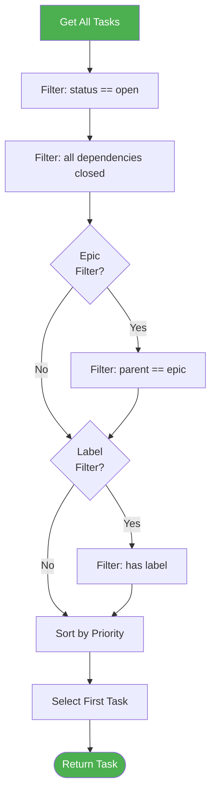
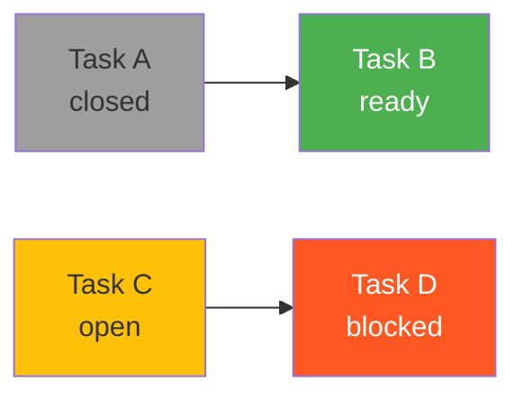

# Task Selection

Task selection determines which task cub executes next. The algorithm ensures work happens in the right order while respecting dependencies and priorities.

## Selection Algorithm

When cub needs a task, it follows this process:



### Step by Step

1. **Get all tasks** from the backend
2. **Filter by status**: Only `open` tasks are considered
3. **Filter by dependencies**: All `dependsOn` tasks must be `closed`
4. **Apply epic filter**: If `--epic` specified, only tasks with matching `parent`
5. **Apply label filter**: If `--label` specified, only tasks with that label
6. **Sort by priority**: P0 first, then P1, P2, P3, P4
7. **Select first**: Take the highest-priority ready task

## Priority Ordering

Tasks are sorted by priority, with lower numbers meaning higher urgency:

| Priority | Description | Use Case |
|----------|-------------|----------|
| **P0** | Critical | Blocking issues, security fixes |
| **P1** | High | Important features, urgent bugs |
| **P2** | Medium | Standard work (default) |
| **P3** | Low | Nice-to-haves, minor improvements |
| **P4** | Backlog | Future work, ideas |

### Priority Examples

Given these tasks:

| ID | Title | Priority | Dependencies | Status |
|----|-------|----------|--------------|--------|
| A | Fix security hole | P0 | - | open |
| B | Add login page | P1 | - | open |
| C | Update readme | P3 | - | open |
| D | Implement auth | P0 | B | open |

Selection order:

1. **A** (P0, no deps)
2. **B** (P1, no deps) - D is P0 but blocked by B
3. **D** (P0, B now closed)
4. **C** (P3, no deps)

!!! important "Dependencies Override Priority"
    Task D has P0 priority but runs after B (P1) because D depends on B. Dependencies always take precedence.

## Dependency Resolution

A task is ready when **all** its dependencies are closed.

### Checking Dependencies

```bash
# Beads - show what blocks a task
bd show cub-042 --json | jq '.blocks'

# JSON - show dependsOn
jq '.tasks[] | select(.id == "myproj-042") | .dependsOn' prd.json
```

### Dependency States



- **Task B** is ready (depends on A, which is closed)
- **Task D** is blocked (depends on C, which is open)

## Epic Filtering

Limit execution to tasks within a specific epic:

```bash
cub run --epic cub-epic-001
```

Only tasks where `parent == "cub-epic-001"` are considered.

### Epic Hierarchy

Epics can contain nested epics:

```
cub-epic-001 (Q1 Features)
+-- cub-epic-002 (User Auth)
|   +-- cub-task-001
|   +-- cub-task-002
+-- cub-epic-003 (Dashboard)
    +-- cub-task-003
```

To run all of Q1:
```bash
cub run --epic cub-epic-001
```

To run only Auth tasks:
```bash
cub run --epic cub-epic-002
```

## Label Filtering

Run only tasks with specific labels:

```bash
# Run frontend tasks
cub run --label frontend

# Run urgent tasks
cub run --label urgent
```

### Common Label Patterns

| Label | Purpose |
|-------|---------|
| `frontend` | UI/UX work |
| `backend` | Server-side work |
| `model:haiku` | Use fast model |
| `model:opus` | Use most capable model |
| `urgent` | High priority |
| `needs-review` | Requires human check |

## Model Selection via Labels

Use `model:` labels to route tasks to specific AI models:

```bash
# Add model label
bd label add cub-042 model:haiku
```

When cub runs task `cub-042`, it passes `haiku` to the harness. This helps manage costs:

| Model | Best For | Token Cost |
|-------|----------|------------|
| `haiku` | Simple tasks, docs, tests | Lowest |
| `sonnet` | Standard development | Medium |
| `opus` | Complex architecture, debugging | Highest |

### Selection with Model Labels

```bash
# Run all tasks, respecting model labels
cub run

# Override model for all tasks
cub run --model sonnet
```

CLI flag overrides task labels.

## Viewing Ready Tasks

Before running, see what's ready:

```bash
# List ready tasks
cub run --ready

# With epic filter
cub run --ready --epic cub-epic-001

# With label filter
cub run --ready --label backend
```

Output:

```
Ready Tasks
+----------+----------+---------+---------------------------+---------+
| ID       | Priority | Type    | Title                     | Labels  |
+----------+----------+---------+---------------------------+---------+
| cub-042  | P1       | feature | Add user authentication   | backend |
| cub-043  | P2       | task    | Write auth tests          | backend |
| cub-044  | P2       | feature | Add login page            | frontend|
+----------+----------+---------+---------------------------+---------+

Total: 3 ready tasks
```

## Running Specific Tasks

Bypass selection and run a specific task:

```bash
cub run --task cub-042
```

This:

- Ignores priority ordering
- Ignores label/epic filters
- Still checks the task is open
- Still executes only that task

Use for:

- Testing a specific task
- Rerunning a failed task
- Working on a particular piece in isolation

## Selection in Parallel Mode

When running parallel (`cub run --parallel 3`):

1. Find all ready tasks (same algorithm as above)
2. Filter to **independent** tasks (no shared dependencies)
3. Take up to N tasks
4. Create worktrees and run concurrently

```bash
cub run --parallel 3 --epic cub-epic-001
```

See [Parallel Execution](../advanced/parallel.md) for details.

## Troubleshooting

??? question "No ready tasks but open tasks exist"
    Check dependencies:
    ```bash
    bd list --status open --json | jq '.[].blocks'
    ```
    Ensure blocking tasks are closed.

??? question "Wrong task selected"
    Check priorities:
    ```bash
    bd list --status open --json | jq '.[] | {id, priority}'
    ```
    Verify filters aren't excluding expected tasks.

??? question "Task keeps getting skipped"
    Ensure dependencies are satisfied and status is `open`:
    ```bash
    bd show cub-042 --json | jq '{status, blocks}'
    ```

??? question "Label filter not working"
    Verify label is set correctly:
    ```bash
    bd show cub-042 --json | jq '.labels'
    ```
    Labels are case-sensitive.

## Best Practices

1. **Use P0 sparingly**: Reserve for truly critical work
2. **Set P2 as default**: Most tasks should be medium priority
3. **Chain with dependencies**: Use deps for order, not just priority
4. **Label consistently**: Establish label conventions in your team
5. **Check ready before running**: Use `--ready` to verify selection

## Next Steps

<div class="grid cards" markdown>

-   :material-check-circle: **[Task Completion](completion.md)**

    ---

    How tasks are marked complete and verified.

-   :material-link-variant: **[Dependencies](../tasks/dependencies.md)**

    ---

    Control execution order with dependencies.

</div>
