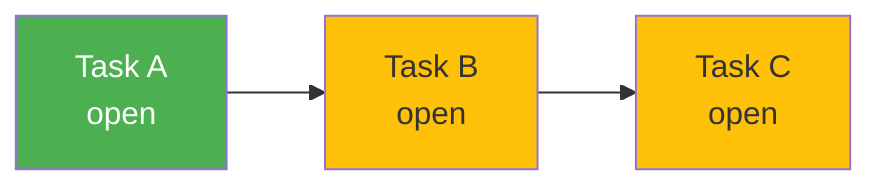
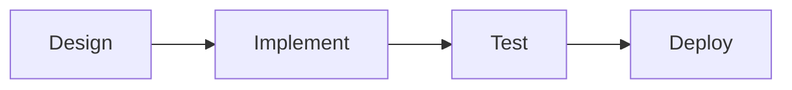
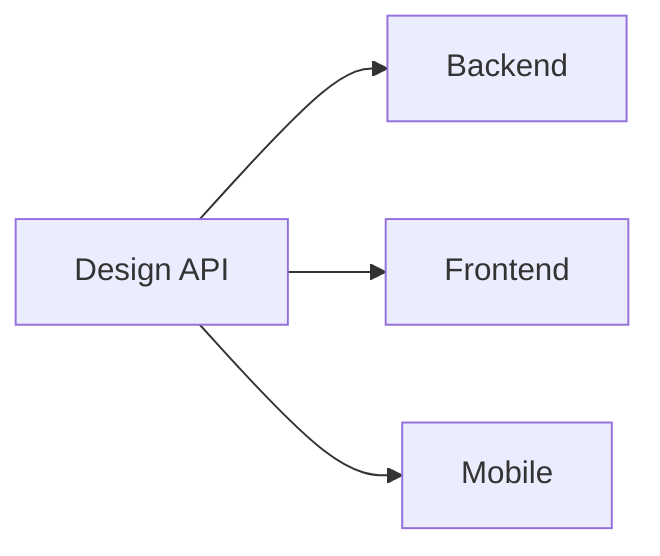
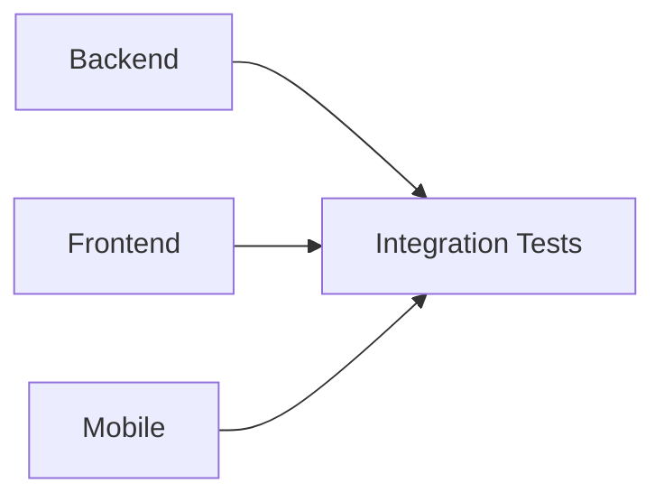
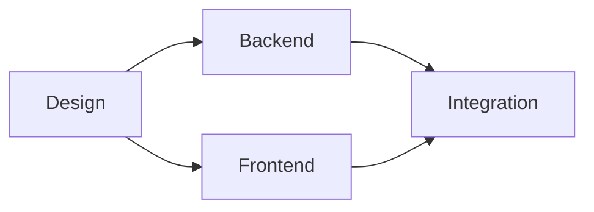
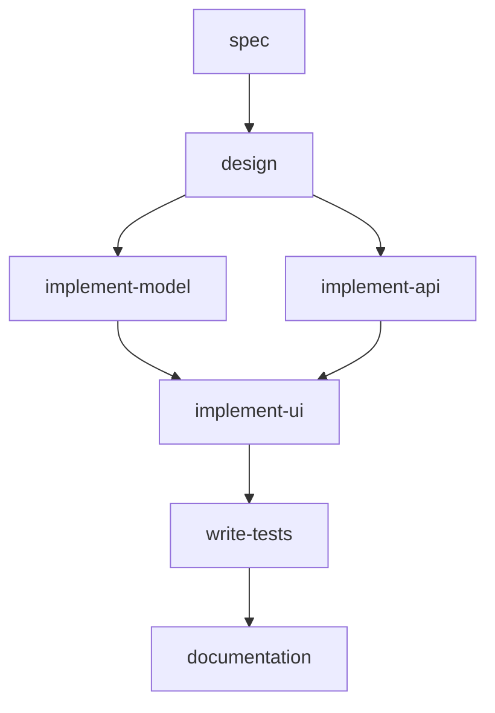
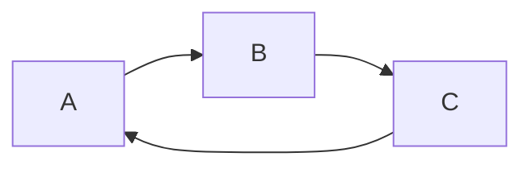

# Task Dependencies

Dependencies allow you to define the order in which tasks must be completed. A task with dependencies won't be selected for execution until all its dependencies are closed.

## How Dependencies Work

When cub selects the next task to run, it:

1. Finds all tasks with `status == "open"`
2. Filters to tasks where **all** dependencies are `closed`
3. Sorts remaining tasks by priority (P0 first)
4. Selects the first one



In this diagram:

- **Task A** is ready (no dependencies)
- **Task B** depends on A (blocked until A closes)
- **Task C** depends on B (blocked until B closes)

## Blocked vs Ready Tasks

**Ready tasks** have:

- Status of `open`
- All dependencies closed (or no dependencies)

**Blocked tasks** have:

- Status of `open`
- One or more dependencies that are not `closed`

Check which tasks are ready:

```bash
# Beads backend
bd ready

# Or with cub
cub run --ready
```

## Setting Up Dependencies

### Beads Backend

Beads uses a `blocks` field (inverse of `dependsOn`):

```bash
# Task B depends on Task A
# Read as: "B is blocked by A"
bd dep add task-B task-A --type blocks

# View a task's dependencies
bd show task-B --json | jq '.blocks'
```

Remove a dependency:

```bash
bd dep remove task-B task-A
```

### JSON Backend

Use the `dependsOn` array:

```json
{
  "tasks": [
    {
      "id": "myproj-001",
      "title": "Design database schema",
      "status": "open",
      "dependsOn": []
    },
    {
      "id": "myproj-002",
      "title": "Implement user model",
      "status": "open",
      "dependsOn": ["myproj-001"]
    },
    {
      "id": "myproj-003",
      "title": "Add user API endpoints",
      "status": "open",
      "dependsOn": ["myproj-002"]
    }
  ]
}
```

## Dependency Patterns

### Sequential Chain

Tasks must execute in strict order:



```bash
# Beads
bd dep add task-B task-A --type blocks
bd dep add task-C task-B --type blocks
bd dep add task-D task-C --type blocks
```

### Fan-Out (Parallel)

Multiple tasks can run after a common prerequisite:



All three implementation tasks become ready once "Design API" closes. Cub runs them one at a time by priority, but they don't block each other.

```json
{
  "tasks": [
    {"id": "api-001", "title": "Design API", "dependsOn": []},
    {"id": "api-002", "title": "Backend implementation", "dependsOn": ["api-001"]},
    {"id": "api-003", "title": "Frontend implementation", "dependsOn": ["api-001"]},
    {"id": "api-004", "title": "Mobile implementation", "dependsOn": ["api-001"]}
  ]
}
```

### Fan-In (Merge)

A task that requires multiple prerequisites:



"Integration Tests" only becomes ready when all three implementations are closed.

```json
{
  "id": "api-005",
  "title": "Integration tests",
  "dependsOn": ["api-002", "api-003", "api-004"]
}
```

### Diamond Pattern

Combining fan-out and fan-in:



```json
{
  "tasks": [
    {"id": "t-001", "title": "Design", "dependsOn": []},
    {"id": "t-002", "title": "Backend", "dependsOn": ["t-001"]},
    {"id": "t-003", "title": "Frontend", "dependsOn": ["t-001"]},
    {"id": "t-004", "title": "Integration", "dependsOn": ["t-002", "t-003"]}
  ]
}
```

## Priority vs Dependencies

**Dependencies always take precedence over priority.**

Even if Task A is P4 (lowest) and Task B is P0 (critical), if B depends on A, then A runs first.

```json
{
  "tasks": [
    {"id": "t-001", "title": "Setup infrastructure", "priority": "P4", "dependsOn": []},
    {"id": "t-002", "title": "Critical feature", "priority": "P0", "dependsOn": ["t-001"]}
  ]
}
```

Execution order: t-001 then t-002 (despite P0 priority).

!!! tip "Use Priority for Independent Tasks"
    Priority determines order among tasks that are *both* ready. Use it to prioritize unrelated work, not to override dependencies.

## Example Workflow: Feature Development

A typical feature implementation:



```bash
# Create tasks
bd create "Write feature spec" --type task -p 1
bd create "Design architecture" --type task -p 2
bd create "Implement data model" --type task -p 2
bd create "Implement API endpoints" --type task -p 2
bd create "Implement UI components" --type task -p 2
bd create "Write integration tests" --type task -p 3
bd create "Update documentation" --type task -p 4

# Set up dependencies
bd dep add cub-002 cub-001 --type blocks
bd dep add cub-003 cub-002 --type blocks
bd dep add cub-004 cub-002 --type blocks
bd dep add cub-005 cub-003 --type blocks
bd dep add cub-005 cub-004 --type blocks
bd dep add cub-006 cub-005 --type blocks
bd dep add cub-007 cub-006 --type blocks
```

## Avoiding Circular Dependencies

Circular dependencies create a deadlock where no task can run:



Cub doesn't explicitly detect cycles, but you'll notice when `cub run --ready` returns no tasks despite open work.

**To fix:**

1. Identify the cycle:
   ```bash
   bd list --status open --json | jq '.[].blocks'
   ```

2. Remove one dependency to break the cycle:
   ```bash
   bd dep remove task-C task-A
   ```

## Gates and Checkpoints

Use `gate` type tasks for manual approval points:

```json
{
  "id": "t-gate-001",
  "title": "Security Review Checkpoint",
  "type": "gate",
  "status": "open",
  "dependsOn": ["t-003", "t-004"]
}
```

Downstream tasks depend on the gate:

```json
{
  "id": "t-005",
  "title": "Deploy to production",
  "dependsOn": ["t-gate-001"]
}
```

The gate blocks production deployment until manually closed:

```bash
# After security review passes
bd close t-gate-001 -r "Security review approved by team lead"
```

## Debugging Dependencies

### See What's Blocking

```bash
# Beads
bd show task-id --json | jq '.blocks'

# JSON
jq '.tasks[] | select(.id == "task-id") | .dependsOn' prd.json
```

### Find All Blocked Tasks

```bash
# Tasks that have unfulfilled dependencies
cub run --ready  # Shows only ready tasks

# Compare with all open
bd list --status open  # Shows all open tasks
```

### Visualize Dependencies

For complex graphs, export and visualize:

```bash
# Generate DOT format
bd list --json | jq -r '
  .[] |
  . as $task |
  (.blocks // [])[] |
  "\($task.id) -> \(.)"
' | sort -u > deps.dot

# Wrap with digraph header
echo "digraph deps {" > graph.dot
cat deps.dot >> graph.dot
echo "}" >> graph.dot

# Render with graphviz
dot -Tpng graph.dot -o dependencies.png
```

## Best Practices

1. **Keep chains short**: Long dependency chains delay execution. Parallelize where possible.

2. **Use epics for grouping, dependencies for ordering**: Don't use dependencies just to group related tasks.

3. **Document non-obvious dependencies**: If the dependency isn't clear from task titles, add a note explaining why.

4. **Validate early**: Run `cub run --ready` before starting to catch missing dependencies.

5. **Avoid micro-dependencies**: Don't create dependencies between tiny tasks that could be combined.

## Next Steps

<div class="grid cards" markdown>

-   :material-sync: **[The Run Loop](../run-loop/index.md)**

    ---

    See how cub selects and executes tasks.

-   :material-clipboard-check: **[Task Selection](../run-loop/selection.md)**

    ---

    Deep dive into the selection algorithm.

</div>
