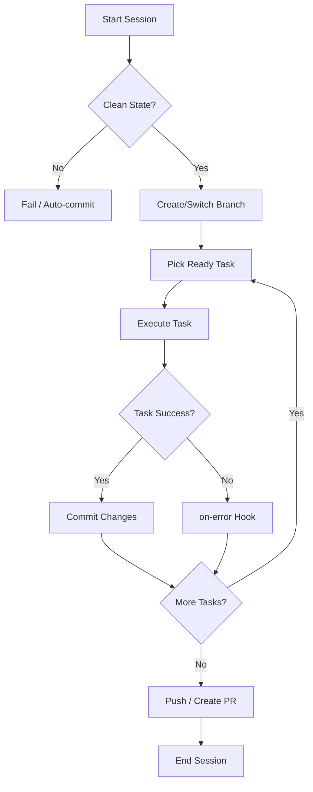

# Git Integration

Cub embraces a git-native workflow where code changes are organized through branches, commits, and pull requests. This disciplined approach enables reliable autonomous operation while maintaining clean version control history.

## Git-Native Philosophy

Cub treats git as the source of truth for work organization:

- **Branch per run**: Each execution session creates an isolated branch
- **Commit per task**: Completed tasks result in atomic, well-documented commits
- **Clean state enforcement**: Git status is verified before and after task execution
- **Pull requests**: Completed work flows through standard code review processes

This approach provides:

1. **Traceability**: Every change links back to a specific task
2. **Rollback**: Easy reversion if something goes wrong
3. **Parallel work**: Multiple sessions can run simultaneously via worktrees
4. **Review integration**: Standard PR workflow for human oversight

## Core Concepts

### Branch per Run

Each cub session creates a dedicated branch for its work. This isolates changes from the main branch and enables parallel development:

```
main
+-- cub/porcupine/20260111-114543   <- Session 1
+-- cub/narwhal/20260111-120000     <- Session 2
```

Branch naming follows the convention: `cub/{session_name}/{timestamp}`

The session name is auto-generated (animal names by default) or can be customized:

```bash
cub run --name release-1.0    # Creates: cub/release-1.0/20260111-114543
```

### Commit per Task

After each completed task, Cub commits the changes with a structured message:

```
task(cub-abc): Implement user authentication

- Added login form component
- Created auth API endpoints
- Added tests for auth flow

Task-Id: cub-abc
Co-Authored-By: Claude Sonnet <noreply@anthropic.com>
```

This provides:

- **Clear attribution**: Which task made which changes
- **Atomic changes**: Each commit represents one logical unit of work
- **AI authorship**: Transparent about AI-generated code

### Clean State Enforcement

Before starting a task, Cub verifies that the git working tree is clean:

```bash
# Check for uncommitted changes
git status --porcelain

# If not clean, Cub can:
# 1. Refuse to continue (strict mode)
# 2. Auto-commit pending changes (permissive mode)
```

Configure clean state behavior in `.cub.json`:

```json
{
  "clean_state": {
    "require_commit": true,
    "require_tests": false,
    "auto_commit": true
  }
}
```

| Setting | Default | Description |
|---------|---------|-------------|
| `require_commit` | `true` | Require all changes to be committed |
| `require_tests` | `false` | Require tests to pass before committing |
| `auto_commit` | `true` | Auto-commit when harness succeeds but forgets to commit |

Override via CLI:

```bash
cub run --require-clean      # Enforce clean state
cub run --no-require-clean   # Allow uncommitted changes
```

## Workflow Diagram



## Quick Reference

| Command | Description |
|---------|-------------|
| [`cub branch`](branches.md) | Create and bind branches to epics |
| [`cub branches`](branches.md#managing-branches) | List and manage branch bindings |
| [`cub pr`](pr.md) | Create pull requests |
| [`cub worktree`](worktrees.md) | Manage worktrees for parallel work |

## Configuration

Git workflow settings in `.cub.json`:

```json
{
  "clean_state": {
    "require_commit": true,
    "require_tests": false,
    "auto_commit": true
  },
  "hooks": {
    "enabled": true
  }
}
```

### Auto-Branch Hook

Enable automatic branch creation at session start:

```bash
# Copy the example hook
mkdir -p .cub/hooks/pre-loop.d
cp examples/hooks/pre-loop.d/10-auto-branch.sh .cub/hooks/pre-loop.d/
chmod +x .cub/hooks/pre-loop.d/10-auto-branch.sh
```

See [Hooks: Examples](../hooks/examples.md) for more details.

## Next Steps

<div class="grid cards" markdown>

-   :material-source-branch: **Branch Management**

    ---

    Create branches, bind them to epics, and manage branch lifecycle.

    [:octicons-arrow-right-24: Branches](branches.md)

-   :material-source-pull: **Pull Requests**

    ---

    Create PRs with auto-generated bodies, handle CI, and merge.

    [:octicons-arrow-right-24: Pull Requests](pr.md)

-   :material-folder-multiple: **Worktrees**

    ---

    Run multiple epics in parallel with isolated working directories.

    [:octicons-arrow-right-24: Worktrees](worktrees.md)

</div>
