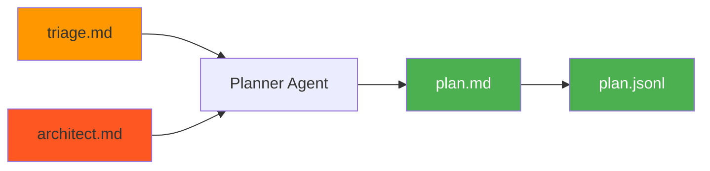
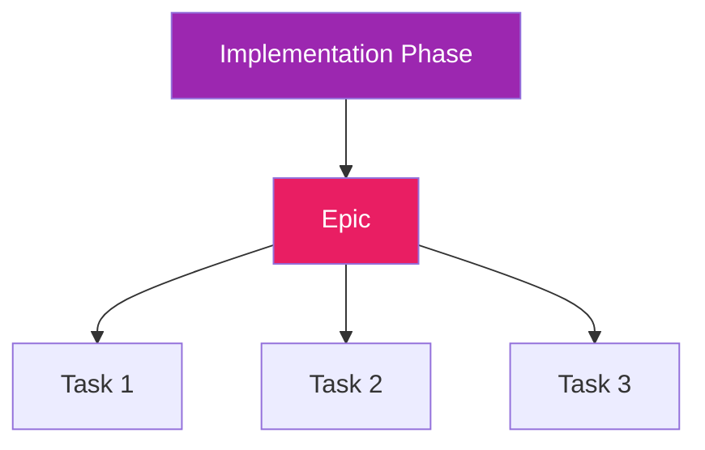

# Plan Stage

Plan is the third stage of the prep pipeline. It breaks down the architecture into executable tasks that an AI coding agent (or human) can pick up and complete in a single session.

## What Plan Does

The plan stage:

- Reviews triage and architect outputs
- Conducts an interview about task preferences
- Decomposes architecture into right-sized tasks
- Organizes work for maximum value delivery
- Outputs tasks in Beads-compatible format



## Running Plan

### Standard Usage

```bash
cub plan
```

This uses the most recent session with completed triage and architect stages.

### Specify Session

```bash
cub plan --session myproject-20260117-143022
```

### Non-Interactive Mode

```bash
cub plan --non-interactive --session myproject-20260117-143022
```

!!! note "Requires Architect"
    Plan requires a completed architect stage. Run `cub architect` first if needed.

## The Plan Interview

The planner agent asks questions to customize task generation:

### Question 1: Task Granularity

> How should work be chunked?
>
> - **Micro**: 15-30 minute tasks (optimal for AI agents)
> - **Standard**: 1-2 hour tasks (good for humans)
> - **Macro**: Half-day to full-day tasks (milestones)
>
> Recommended: **Micro** for AI agent execution

### Question 2: Task Prefix

> What prefix should I use for task IDs?
>
> Default: project name abbreviation (e.g., `myproj-`)

### Question 3: Priorities

> Any tasks that should be prioritized or done first?

### Question 4: Exclusions

> Are there any tasks we should explicitly exclude or defer?

## Task Sizing Guidelines

For **Micro** granularity (recommended for AI agents):

| Guideline | Target |
|-----------|--------|
| Duration | 15-30 minutes |
| Description size | ~2000 tokens |
| Objectives | One clear objective per task |
| Criteria | Explicit, verifiable acceptance criteria |

!!! tip "When in Doubt, Split"
    If a task feels too big or has multiple objectives, split it into smaller tasks.

## Task Decomposition

The planner transforms architecture phases into a task hierarchy:



### Level 1: Epics (from Implementation Phases)

Each phase from the architecture becomes an Epic - a container for related tasks.

### Level 2: Tasks (implementation steps)

Each epic contains tasks that can be completed in one context window.

## Dependency Rules

The planner automatically wires dependencies:

```
Infrastructure/setup tasks
        |
        v
Data models and schemas
        |
        v
Services that use the models
        |
        v
UI that calls the services
        |
        v
Tests (parallel or after implementation)
        |
        v
Documentation
```

## Vertical Slices over Horizontal Layers

The planner organizes for value delivery, not just technical convenience:

**Horizontal (avoid):**
```
Build all models -> Build all services -> Build all UI
```

**Vertical (preferred):**
```
Build User login (model + service + UI)
        |
        v
Build Dashboard (model + service + UI)
        |
        v
Build Settings (model + service + UI)
```

Each vertical slice is:

- **Demonstrable**: Something a user can see or interact with
- **Testable**: Can verify it works end-to-end
- **Valuable**: Delivers actual functionality

## Checkpoints

The planner identifies natural pause points where:

- A meaningful capability is complete
- User testing/feedback would be valuable
- The product could ship (even if minimal)
- Assumptions from triage can be validated

These are marked with the `checkpoint` label.

## Priority Levels

| Priority | Meaning | Examples |
|----------|---------|----------|
| **P0** | Critical path - blocks everything | Project setup, core schema |
| **P1** | Important - needed for core functionality | Auth, main features |
| **P2** | Standard - part of the plan but flexible | Secondary features |
| **P3** | Low - nice to have, can defer | Polish, optimization |

## Task Labels

Every task gets labels for filtering and model selection:

### Required Labels

| Label Type | Values | Purpose |
|------------|--------|---------|
| **Phase** | `phase-1`, `phase-2`, etc. | Implementation phase |
| **Model** | `model:opus`, `model:sonnet`, `model:haiku` | AI model selection |
| **Complexity** | `complexity:high`, `complexity:medium`, `complexity:low` | Effort indicator |

### Model Selection Guidelines

| Model | Use For |
|-------|---------|
| `model:opus` | Complex architectural decisions, security-sensitive, novel problems |
| `model:sonnet` | Standard feature work, API integrations, moderate complexity |
| `model:haiku` | Boilerplate, repetitive patterns, simple changes, docs |

!!! tip "When in Doubt"
    Use `model:sonnet` as the default - it handles most tasks well.

### Optional Labels

| Label | Purpose |
|-------|---------|
| `setup`, `model`, `api`, `ui`, `logic`, `test`, `docs` | Domain category |
| `risk:high`, `risk:medium`, `experiment` | Risk indicator |
| `checkpoint`, `blocking`, `quick-win` | Special markers |
| `slice:{name}` | Vertical slice grouping |

## Task Description Template

Every task includes structured context for the agent:

```markdown
## Context
Why this task exists and how it fits the bigger picture.

## Implementation Hints

**Recommended Model:** sonnet
**Estimated Duration:** 30m
**Approach:** Brief actionable guidance

## Implementation Steps
1. Concrete step 1
2. Concrete step 2
3. Concrete step 3

## Acceptance Criteria
- [ ] Specific, verifiable criterion
- [ ] Specific, verifiable criterion

## Files Likely Involved
- path/to/file.ext

## Notes
Any gotchas, references, or helpful context.
```

## Output Files

Plan produces two outputs:

### plan.md (Human-Readable)

Structured markdown for review:

```markdown
# Plan

## Epic: E01 - Setup Infrastructure
Priority: 1
Labels: phase-1, setup
Description:
Set up project foundation and tooling.

### Task: 001 - Initialize project structure
Priority: 0
Labels: phase-1, setup, model:haiku, complexity:low
Description:
Create directory structure and basic config.

## Context
Foundation task that enables all other work.

## Implementation Steps
1. Create src/ directory structure
2. Add pyproject.toml with dependencies
3. Configure logging

## Acceptance Criteria
- [ ] Project structure matches architecture
- [ ] Dependencies install cleanly
```

### plan.jsonl (Machine-Readable)

Beads-compatible JSONL for import:

```json
{"id":"proj-E01","title":"Setup Infrastructure","description":"...","status":"open","priority":1,"issue_type":"epic","labels":["phase-1","setup"],"dependencies":[]}
{"id":"proj-001","title":"Initialize project structure","description":"...","status":"open","priority":0,"issue_type":"task","labels":["phase-1","setup","model:haiku","complexity:low"],"dependencies":[{"depends_on_id":"proj-E01","type":"parent-child"}]}
```

## Example Plan Summary

After generating the plan, you'll see a summary:

```
Plan generated: 3 epics, 15 tasks

Breakdown:
  Phase 1 (Foundation): 5 tasks
  Phase 2 (Core Features): 7 tasks
  Phase 3 (Polish): 3 tasks

Ready to start immediately: 2 tasks (no blockers)

JSONL: .cub/sessions/myproject-20260117-143022/plan.jsonl
Summary: .cub/sessions/myproject-20260117-143022/plan.md

Next step: cub bootstrap myproject-20260117-143022
```

## CLI Reference

```
Usage: cub plan [OPTIONS] [SESSION_ID]

Stage 3: Task Decomposition

Arguments:
  SESSION_ID         Session ID from architect (default: most recent)

Options:
  --session ID       Specify session ID
  --non-interactive  Run without interactive Claude session
  -h, --help         Show this help message

Examples:
  cub plan                         # Use most recent session
  cub plan --session ID            # Specific session

Output:
  .cub/sessions/{session-id}/plan.jsonl  (Beads-compatible)
  .cub/sessions/{session-id}/plan.md     (Human-readable)
```

## Principles

!!! tip "Right-Sized Tasks"
    Completable in one focused session. If it feels too big, split it.

!!! tip "Clear Boundaries"
    One objective per task. Multiple objectives = multiple tasks.

!!! tip "Explicit Dependencies"
    Don't assume the agent will figure out the order. Wire dependencies explicitly.

!!! tip "Actionable Descriptions"
    Someone should be able to start immediately with the information provided.

!!! tip "Verifiable Completion"
    Acceptance criteria should be checkable - tests pass, file exists, API responds.

!!! tip "Context is Cheap"
    Include relevant context. Agents don't remember previous tasks.

## Next Step

Once plan is complete, write tasks to your backend:

```bash
cub bootstrap
```

[:octicons-arrow-right-24: Bootstrap Stage](bootstrap.md)
