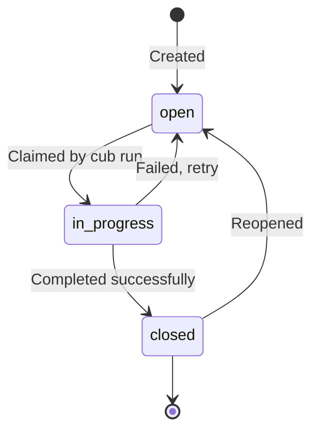

# Task Management

Tasks are the fundamental unit of work in Cub. Each task represents a discrete, agent-sized piece of work that can be executed autonomously by an AI harness.

## What is a Task?

A task is a structured work item that contains everything an AI agent needs to:

1. **Understand** what needs to be done
2. **Execute** the work independently
3. **Verify** completion via acceptance criteria
4. **Signal** when finished

Good tasks are:

- **Specific**: Clear scope and boundaries
- **Actionable**: Can be started immediately
- **Measurable**: Has clear completion criteria
- **Agent-sized**: Achievable in a single session

## Task Fields

Every task has these core fields:

| Field | Type | Description |
|-------|------|-------------|
| `id` | string | Unique identifier (e.g., `cub-001`, `myproj-abc4`) |
| `title` | string | Brief summary of what needs to be done |
| `description` | string | Detailed explanation, context, and requirements |
| `status` | enum | Current state: `open`, `in_progress`, `closed` |
| `priority` | enum | Urgency level: `P0` through `P4` |
| `type` | enum | Category: `task`, `feature`, `bug`, `bugfix`, `epic`, `gate` |

### Optional Fields

| Field | Type | Description |
|-------|------|-------------|
| `dependsOn` | array | Task IDs that must complete first |
| `labels` | array | Tags for filtering and routing (e.g., `model:haiku`) |
| `parent` | string | Parent epic ID for hierarchical organization |
| `assignee` | string | Session or user assigned to work on this |
| `acceptanceCriteria` | array | List of conditions that define "done" |
| `notes` | string | Additional comments or context |

## Task Types

Use the appropriate type to categorize work:

| Type | Description | Examples |
|------|-------------|----------|
| `task` | General work item | "Refactor database queries", "Update documentation" |
| `feature` | New functionality | "Add user authentication", "Implement search" |
| `bug` | Defect fix | "Fix login timeout", "Correct calculation error" |
| `bugfix` | Alias for bug | Same as `bug` |
| `epic` | Container for related tasks | "User Management System", "API v2 Migration" |
| `gate` | Checkpoint requiring approval | "Code Review: Phase 1", "Security Audit" |

## Priority Levels

Priority determines task selection order. Lower numbers = higher urgency:

| Priority | Meaning | Selection Order |
|----------|---------|-----------------|
| `P0` | Critical - must be done immediately | First |
| `P1` | High - important and urgent | Second |
| `P2` | Medium - standard priority (default) | Third |
| `P3` | Low - do when time permits | Fourth |
| `P4` | Backlog - future consideration | Last |

!!! tip "Priority vs Dependencies"
    Dependencies always take precedence over priority. A P4 task will run before a P0 task if the P0 task depends on it.

## Task Status Lifecycle

Tasks move through these states:



### Status Definitions

**open**
:   Task is ready to be worked on (assuming dependencies are met). This is the initial state for all new tasks.

**in_progress**
:   Task has been claimed by a cub session and is being actively worked on. Only one session should work on a task at a time.

**closed**
:   Task has been completed. The AI has signaled completion by closing the task via the backend.

## Task Example

Here's a complete task definition:

=== "Beads (bd show)"

    ```json
    {
      "id": "cub-042",
      "title": "Add dark mode toggle to settings",
      "description": "Implement a toggle switch in the user settings page that allows users to switch between light and dark themes. The preference should persist in localStorage.",
      "status": "open",
      "priority": 2,
      "issue_type": "feature",
      "labels": ["frontend", "model:sonnet"],
      "parent": "cub-040",
      "blocks": ["cub-043"],
      "acceptance_criteria": [
        "Toggle appears in settings page",
        "Theme changes immediately on toggle",
        "Preference persists across sessions",
        "All existing tests pass"
      ]
    }
    ```

=== "JSON (prd.json)"

    ```json
    {
      "id": "myproj-042",
      "title": "Add dark mode toggle to settings",
      "description": "Implement a toggle switch in the user settings page...",
      "status": "open",
      "priority": "P2",
      "type": "feature",
      "labels": ["frontend", "model:sonnet"],
      "parent": "myproj-040",
      "dependsOn": [],
      "acceptanceCriteria": [
        "Toggle appears in settings page",
        "Theme changes immediately on toggle",
        "Preference persists across sessions",
        "All existing tests pass"
      ]
    }
    ```

## Labels for Model Selection

Use `model:` labels to route tasks to specific AI models:

```bash
# Fast model for simple tasks
bd label add cub-042 model:haiku

# Balanced model for most work
bd label add cub-042 model:sonnet

# Most capable for complex work
bd label add cub-042 model:opus
```

When cub runs a task, it reads the `model:` label and passes it to the harness. This helps manage costs by using the right model for each task's complexity.

## Task Backends

Cub supports two backends for task storage:

<div class="grid cards" markdown>

-   :material-database: **[Beads Backend](beads.md)**

    ---

    Full-featured CLI for task management with rich querying, dependencies, and git integration.

    [:octicons-arrow-right-24: Learn about Beads](beads.md)

-   :material-code-json: **[JSON Backend](json.md)**

    ---

    Simple file-based storage in `prd.json`. No external tools needed.

    [:octicons-arrow-right-24: Learn about JSON](json.md)

</div>

## Quick Reference

### Viewing Tasks

```bash
# List all tasks
bd list

# Show task details
bd show cub-042

# Find ready tasks
cub run --ready
```

### Creating Tasks

```bash
# Via beads CLI
bd create "Add dark mode toggle" --type feature --priority 2

# Via prd.json
# Add entry to the "tasks" array
```

### Closing Tasks

```bash
# Via beads CLI
bd close cub-042 -r "Implemented with tests"

# Via prd.json
# Set status to "closed"
```

## Next Steps

<div class="grid cards" markdown>

-   :material-clipboard-check: **[Task Dependencies](dependencies.md)**

    ---

    Learn how to chain tasks and manage execution order.

-   :material-sync: **[The Run Loop](../run-loop/index.md)**

    ---

    Understand how Cub selects and executes tasks.

</div>
