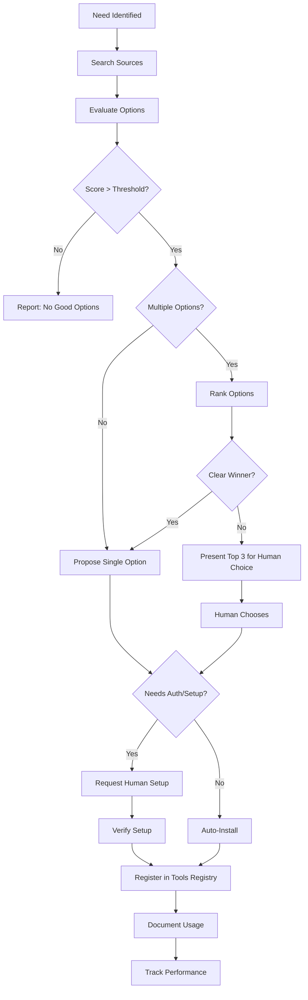

# Toolsmith: Automated Tool Discovery and Adoption

## Overview

A meta-tool that helps cub discover, evaluate, and adopt tools it needs during the development lifecycle. When cub encounters a need (e.g., "parse JSON with complex queries"), toolsmith searches common tool sources, evaluates options, proposes solutions, and handles adoption—including surfacing when human input is needed (API keys, budget allocation).

**Key insight:** Most of the tools in TOOLS-WISHLIST.md can be implemented by discovering and composing existing tools rather than building from scratch.

## Problem Statement

Currently, when cub needs a capability:
1. **Human manually searches** for tools
2. **Human evaluates** options
3. **Human integrates** tool into cub
4. **Human maintains** tool knowledge

This is slow, inconsistent, and doesn't scale as cub's needs grow.

**Example scenarios where toolsmith helps:**

- **During spec review:** Spec needs "Design Pattern Matcher" → toolsmith searches GitHub for pattern libraries, MCP servers for code search, Claude skills for similar tools
- **During implementation:** Task needs browser automation → toolsmith finds Playwright MCP server, Puppeteer skill, Selenium options; compares them; proposes best fit
- **During triage:** Feature needs API design validation → toolsmith discovers API linting tools, suggests integration approach

## Goals

1. **Automated discovery** - Search common sources for tools matching a need
2. **Multi-option tracking** - Maintain multiple candidates per need with pros/cons
3. **Intelligent evaluation** - Score tools on criteria (maturity, integration complexity, cost)
4. **Guided adoption** - Provide integration steps, including auth/setup
5. **Human handoff** - Surface when manual action needed (API keys, budget approval)
6. **Continuous learning** - Track which tools work well, deprecate poor fits

## Non-Goals (v1)

- Building tools from scratch (focus on discovery/adoption)
- Automatic installation without approval
- Complex multi-tool orchestration (that's workflow management)
- Tool version management (punt to package managers)

---

## Architecture

### Discovery Sources

Prioritized list of where to search for tools:

#### 1. MCP Server Registry
- **Source:** https://github.com/modelcontextprotocol/servers
- **What:** Official and community MCP servers
- **Search:** Filter by capability (filesystem, database, browser, etc)
- **Pros:** Standardized interface, growing ecosystem
- **Integration:** Via tools registry MCP support

#### 2. Claude Skills (Anthropic + Community)
- **Source:** Anthropic marketplace, GitHub topics, ClawdHub
- **What:** Pre-built skills for Claude Code / Clawdbot
- **Search:** Keyword search, category browse
- **Pros:** Pre-integrated with Claude, battle-tested
- **Integration:** Via Clawdbot skills system (if available)

#### 3. Package Registries
- **npm:** JavaScript/TypeScript tools
- **PyPI:** Python tools
- **Go modules:** Go tools
- **Source:** Registry APIs + README parsing
- **Search:** Keyword + category tags
- **Pros:** Massive ecosystem, well-documented
- **Integration:** Via CLI wrappers or language interop

#### 4. GitHub
- **Source:** GitHub API search
- **What:** Open source projects, scripts, examples
- **Search:** Topic tags, README keywords, stars/forks
- **Pros:** Find anything, see real usage
- **Cons:** Quality varies, integration effort varies
- **Integration:** Clone + wrap, or extract patterns

#### 5. Specialized Registries
- **Awesome Lists:** Curated tool collections
- **Docker Hub:** Containerized tools
- **Homebrew:** macOS CLI tools
- **apt/yum:** Linux packages

### Tool Evaluation Rubric

Score each discovered tool on multiple dimensions:

```yaml
evaluation:
  maturity:
    stars: >1000 → 10, 100-1000 → 7, <100 → 3
    recent_commits: <30 days → 10, <90 days → 7, >90 days → 3
    issues_resolved: >80% → 10, >60% → 7, <60% → 3
    
  integration_complexity:
    standardized_api: MCP/Skill → 10, CLI → 7, Library → 5, Manual → 2
    auth_required: None → 10, API key → 7, OAuth → 5, Complex → 2
    dependencies: None → 10, Few → 7, Many → 5, Heavyweight → 2
    
  cost:
    free: → 10
    freemium: → 7
    paid: → score based on budget
    
  fit:
    exact_match: → 10
    close_match: → 7
    partial_match: → 5
    workaround: → 3
    
  trust:
    official: → 10
    well_known: → 8
    community: → 6
    unknown: → 4
```

**Overall score:** Weighted average (maturity 30%, integration 30%, fit 25%, cost 10%, trust 5%)

### Tool Adoption Workflow



### Storage

Track discovered tools and evaluation history:

```
.cub/toolsmith/
  discovered/
    {need-id}/
      options.json       # All discovered options
      evaluation.json    # Scoring results
      chosen.json        # Which was adopted (if any)
  
  adopted/
    {tool-id}/
      metadata.json      # Tool info
      integration.md     # How to use
      performance.jsonl  # Usage tracking
```

**options.json:**
```json
{
  "need": "design_pattern_matcher",
  "discovered_at": "2026-01-19T17:20:00Z",
  "options": [
    {
      "id": "refactoring-guru-api",
      "name": "Refactoring Guru API",
      "source": "web",
      "url": "https://refactoring.guru/",
      "type": "web_scraping",
      "description": "Comprehensive design pattern catalog",
      "scores": {
        "maturity": 9,
        "integration": 5,
        "fit": 8,
        "cost": 10,
        "trust": 9,
        "overall": 8.2
      },
      "pros": ["Comprehensive", "Well-documented", "Free"],
      "cons": ["No API", "Needs scraping", "Manual integration"],
      "integration_approach": "Web scraping or manual pattern extraction"
    },
    {
      "id": "sourcegraph-search",
      "name": "Sourcegraph Code Search",
      "source": "github",
      "url": "https://sourcegraph.com/",
      "type": "api",
      "description": "Search code patterns across millions of repos",
      "scores": {
        "maturity": 10,
        "integration": 8,
        "fit": 9,
        "cost": 7,
        "trust": 10,
        "overall": 9.0
      },
      "pros": ["Powerful search", "API available", "Battle-tested"],
      "cons": ["Requires API key", "Rate limits", "Freemium"],
      "integration_approach": "API client, requires API key",
      "auth_needed": true
    },
    {
      "id": "github-code-search-mcp",
      "name": "GitHub Code Search MCP",
      "source": "mcp_registry",
      "url": "https://github.com/example/mcp-github-search",
      "type": "mcp_server",
      "description": "MCP server for GitHub code search",
      "scores": {
        "maturity": 6,
        "integration": 10,
        "fit": 8,
        "cost": 10,
        "trust": 7,
        "overall": 8.4
      },
      "pros": ["MCP standard", "Easy integration", "Free (GitHub API)"],
      "cons": ["Less mature", "GitHub API limits"],
      "integration_approach": "Install MCP server, configure GitHub token",
      "auth_needed": true
    }
  ]
}
```

---

## CLI Interface

```bash
# Discover tools for a need
cub toolsmith search "design pattern matcher"
cub toolsmith search --need-id design_pattern_matcher

# Evaluate discovered options
cub toolsmith evaluate design_pattern_matcher

# Adopt a tool
cub toolsmith adopt design_pattern_matcher --option sourcegraph-search
cub toolsmith adopt design_pattern_matcher --interactive  # Choose from ranked list

# List adopted tools
cub toolsmith list

# Track tool performance
cub toolsmith stats sourcegraph-search

# Deprecate/remove a tool
cub toolsmith remove sourcegraph-search

# Re-evaluate needs (find better options)
cub toolsmith refresh design_pattern_matcher
```

---

## Human Handoff Scenarios

### Scenario 1: Authentication Required

```
🔍 Toolsmith found: Sourcegraph Code Search
   Score: 9.0/10 (best option)
   
   ⚠️  Requires API key
   
   To adopt this tool:
   1. Sign up at https://sourcegraph.com/
   2. Generate API key at https://sourcegraph.com/user/settings/tokens
   3. Run: cub toolsmith adopt sourcegraph-search --api-key YOUR_KEY
   
   Alternative (no auth): github-code-search-mcp (score: 8.4/10)
```

### Scenario 2: Cost/Budget Approval

```
🔍 Toolsmith found: OpenAI API for embeddings
   Score: 9.5/10 (best option)
   
   💰 Estimated cost: $0.10 per 1000 searches
   
   Approve budget allocation?
   [Y/n] _
```

### Scenario 3: Multiple Good Options

```
🔍 Toolsmith found 3 good options for "browser automation":
   
   1. playwright-mcp (9.2/10)
      ✅ MCP standard, mature, free
      ⚠️  Requires browser install
      
   2. puppeteer-skill (8.8/10)
      ✅ Battle-tested, Claude skill available
      ⚠️  Node.js dependency
      
   3. selenium-wrapper (7.5/10)
      ✅ Industry standard, widely used
      ⚠️  Complex setup, slower
   
   Which should I adopt? [1-3 or 'compare'] _
```

---

## Self-Bootstrapping: Implementing Wishlist Tools

Toolsmith can help implement itself and other wishlist tools by discovering existing components. Here's how 5 priority tools could be implemented:

### 1. Design Pattern Matcher

**Need:** Find proven patterns for common problems

**Toolsmith search results:**

```yaml
options:
  - name: Refactoring Guru
    type: Pattern catalog (web scraping)
    score: 8.2
    implementation: Scrape pattern catalog, build local index
    
  - name: Sourcegraph Code Search
    type: Code search API
    score: 9.0
    implementation: Search GitHub for pattern implementations
    auth: API key required
    
  - name: GitHub GraphQL API
    type: Direct repo search
    score: 8.5
    implementation: Query repos by topic tags, extract patterns from READMEs
    auth: GitHub token
```

**Recommended implementation:**
```python
# Design Pattern Matcher using GitHub GraphQL + Sourcegraph

class DesignPatternMatcher:
    def __init__(self):
        self.github = GitHubClient(token=os.getenv('GITHUB_TOKEN'))
        self.sourcegraph = SourcegraphClient(api_key=os.getenv('SOURCEGRAPH_KEY'))
        
    def find_pattern(self, problem_description: str) -> list[Pattern]:
        """Find design patterns matching problem"""
        
        # Search Sourcegraph for implementations
        code_examples = self.sourcegraph.search(
            query=f"{problem_description} language:python",
            type="code"
        )
        
        # Search GitHub for repos with pattern discussions
        repos = self.github.search_repos(
            query=f"{problem_description} design pattern",
            sort="stars"
        )
        
        # Extract patterns from READMEs
        patterns = []
        for repo in repos[:5]:
            readme = self.github.get_readme(repo)
            pattern = self._extract_pattern(readme, problem_description)
            if pattern:
                patterns.append(pattern)
        
        return self._rank_patterns(patterns)
```

**Toolsmith adoption steps:**
1. Discover: Search GitHub for "design pattern" + "code search"
2. Evaluate: Sourcegraph scores highest (9.0)
3. Human handoff: Request Sourcegraph API key
4. Integrate: Generate client wrapper
5. Document: Add to tools registry
6. Track: Monitor usage and effectiveness

---

### 2. Competitive Analysis Tool

**Need:** Compare our approach to existing solutions

**Toolsmith search results:**

```yaml
options:
  - name: GitHub Topics API
    type: Repo discovery
    score: 8.5
    implementation: Search repos by topic, parse READMEs
    auth: GitHub token
    
  - name: npm/PyPI APIs
    type: Package registry search
    score: 8.0
    implementation: Search packages, extract descriptions
    auth: None
    
  - name: awesome-lists
    type: Curated catalogs
    score: 7.5
    implementation: Clone awesome lists, parse markdown
    auth: None
```

**Recommended implementation:**
```python
# Competitive Analysis Tool using GitHub + npm + awesome-lists

class CompetitiveAnalysisTool:
    def analyze(self, domain: str, our_approach: str) -> CompetitiveAnalysis:
        """Analyze how others solve this problem"""
        
        # Search GitHub repos
        repos = self._search_github_repos(domain)
        
        # Search package registries
        npm_packages = self._search_npm(domain)
        pypi_packages = self._search_pypi(domain)
        
        # Search awesome lists
        awesome_entries = self._search_awesome_lists(domain)
        
        # Combine and analyze
        competitors = repos + npm_packages + pypi_packages + awesome_entries
        
        # Extract features/approaches
        analysis = self._compare_approaches(competitors, our_approach)
        
        return CompetitiveAnalysis(
            competitors=competitors,
            common_features=analysis.common_features,
            unique_approaches=analysis.unique_approaches,
            trade_offs=analysis.trade_offs,
            recommendations=analysis.recommendations
        )
    
    def _search_github_repos(self, domain: str) -> list[Repo]:
        # Use GitHub API to find related repos
        query = f"{domain} stars:>100 pushed:>2024-01-01"
        repos = github.search_repositories(q=query, sort="stars", order="desc")
        
        # Parse READMEs for features
        for repo in repos[:10]:
            repo.features = self._extract_features(repo.readme)
        
        return repos
```

**Toolsmith adoption steps:**
1. Discover: GitHub API (built-in), npm API (free), PyPI API (free)
2. Evaluate: All score 8+, no auth needed
3. Integrate: Build unified search interface
4. Document: Usage examples in tools registry
5. Track: Which sources provide best insights

---

### 3. Trade-off Analyzer

**Need:** Compare multiple approaches objectively

**Toolsmith search results:**

```yaml
options:
  - name: LLM-based comparison
    type: Prompt engineering
    score: 9.0
    implementation: Structured prompt with scoring rubric
    cost: LLM API calls
    
  - name: Decision matrix libraries
    type: Python packages
    score: 7.0
    implementation: Libraries like python-decision-matrix
    auth: None
```

**Recommended implementation:**
```python
# Trade-off Analyzer using LLM + structured scoring

class TradeoffAnalyzer:
    SCORING_RUBRIC = {
        "complexity": "How complex to implement? (1-10, 1=simple)",
        "performance": "Runtime performance? (1-10, 10=fast)",
        "maintainability": "Easy to maintain? (1-10, 10=easy)",
        "risk": "Implementation risk? (1-10, 1=low risk)",
        "cost": "Development + runtime cost? (1-10, 1=cheap)"
    }
    
    def analyze(self, options: list[dict], criteria: dict = None) -> Analysis:
        """Compare options using structured scoring"""
        
        criteria = criteria or self.SCORING_RUBRIC
        
        # For each option, get LLM scores
        scores = {}
        for option in options:
            prompt = self._build_scoring_prompt(option, criteria)
            response = llm.complete(prompt, temperature=0.3)
            scores[option['name']] = self._parse_scores(response)
        
        # Generate comparison matrix
        matrix = self._build_matrix(scores, criteria)
        
        # Identify trade-offs
        trade_offs = self._identify_tradeoffs(scores)
        
        # Make recommendation
        recommendation = self._recommend(scores, criteria)
        
        return Analysis(
            matrix=matrix,
            trade_offs=trade_offs,
            recommendation=recommendation,
            explanation=self._explain_recommendation(recommendation, scores)
        )
    
    def _build_scoring_prompt(self, option: dict, criteria: dict) -> str:
        return f"""
        Analyze this approach and score it on the following criteria:
        
        Approach: {option['description']}
        Context: {option.get('context', '')}
        
        Criteria:
        {self._format_criteria(criteria)}
        
        For each criterion, provide:
        1. Score (1-10)
        2. Brief justification (one sentence)
        
        Respond in JSON format.
        """
```

**Toolsmith adoption steps:**
1. Discover: Existing LLM capabilities (Claude available)
2. Evaluate: LLM-based scores 9.0 (structured prompts work well)
3. Integrate: Build prompt templates
4. Document: Scoring rubric, criteria customization
5. Track: Accuracy of recommendations over time

---

### 4. API Design Validator

**Need:** Check if API design is ergonomic and complete

**Toolsmith search results:**

```yaml
options:
  - name: OpenAPI Validator
    type: Linting tool
    score: 8.5
    implementation: Use spectral or openapi-validator
    auth: None
    
  - name: LLM-based review
    type: Prompt engineering
    score: 8.8
    implementation: Prompt with API design principles
    cost: LLM calls
    
  - name: api-lint (npm)
    type: CLI tool
    score: 7.5
    implementation: Wrap existing npm package
    auth: None
```

**Recommended implementation:**
```python
# API Design Validator combining OpenAPI validation + LLM review

class APIDesignValidator:
    def validate(self, api_spec: dict | str) -> ValidationResult:
        """Validate API design for completeness and ergonomics"""
        
        issues = []
        
        # 1. Structural validation (if OpenAPI format)
        if self._is_openapi(api_spec):
            structural = self._validate_openapi(api_spec)
            issues.extend(structural)
        
        # 2. LLM-based ergonomics review
        ergonomics = self._review_ergonomics(api_spec)
        issues.extend(ergonomics)
        
        # 3. Consistency check
        consistency = self._check_consistency(api_spec)
        issues.extend(consistency)
        
        # 4. Completeness check
        completeness = self._check_completeness(api_spec)
        issues.extend(completeness)
        
        return ValidationResult(
            issues=issues,
            score=self._calculate_score(issues),
            suggestions=self._generate_suggestions(issues)
        )
    
    def _review_ergonomics(self, api_spec: dict) -> list[Issue]:
        """Use LLM to review API ergonomics"""
        
        prompt = f"""
        Review this API design for ergonomics and usability:
        
        {json.dumps(api_spec, indent=2)}
        
        Check for:
        1. Intuitive endpoint naming
        2. Consistent parameter conventions
        3. Missing CRUD operations
        4. Edge case handling
        5. Error response clarity
        6. Documentation quality
        
        For each issue found, provide:
        - Severity (critical/major/minor)
        - Location (endpoint/parameter)
        - Description
        - Suggested fix
        """
        
        response = llm.complete(prompt, temperature=0.3)
        return self._parse_issues(response)
```

**Toolsmith adoption steps:**
1. Discover: OpenAPI validators (npm), LLM capabilities
2. Evaluate: Hybrid approach scores 9.0
3. Integrate: Combine structural + ergonomic validation
4. Document: API design principles, validation checklist
5. Track: Which issues are most common

---

### 5. Technical Feasibility Checker

**Need:** Quick validation that approach is technically viable

**Toolsmith search results:**

```yaml
options:
  - name: npm/PyPI registry APIs
    type: Package lookup
    score: 9.0
    implementation: Query registries for package existence
    auth: None
    
  - name: GitHub repo status checker
    type: GitHub API
    score: 8.5
    implementation: Check repo stars, commits, issues
    auth: GitHub token
    
  - name: Libraries.io API
    type: Multi-registry search
    score: 8.8
    implementation: Search across npm, PyPI, etc
    auth: API key (optional)
```

**Recommended implementation:**
```python
# Technical Feasibility Checker using registry APIs + GitHub

class TechnicalFeasibilityChecker:
    def check(self, requirement: str, language: str = None) -> FeasibilityReport:
        """Check if requirement is technically feasible"""
        
        # 1. Search package registries
        packages = self._search_registries(requirement, language)
        
        # 2. Check GitHub for implementations
        repos = self._search_github(requirement)
        
        # 3. Evaluate package maturity
        evaluations = []
        for pkg in packages + repos:
            eval = self._evaluate_package(pkg)
            evaluations.append(eval)
        
        # 4. Estimate integration complexity
        complexity = self._estimate_complexity(evaluations)
        
        # 5. Identify risks
        risks = self._identify_risks(evaluations)
        
        return FeasibilityReport(
            feasible=len(evaluations) > 0,
            options=evaluations,
            recommended=max(evaluations, key=lambda e: e.score),
            complexity=complexity,
            risks=risks,
            confidence=self._calculate_confidence(evaluations)
        )
    
    def _evaluate_package(self, pkg: Package) -> PackageEvaluation:
        """Evaluate package quality"""
        
        scores = {
            'maturity': self._score_maturity(pkg),
            'maintenance': self._score_maintenance(pkg),
            'popularity': self._score_popularity(pkg),
            'compatibility': self._score_compatibility(pkg)
        }
        
        return PackageEvaluation(
            package=pkg,
            scores=scores,
            overall=sum(scores.values()) / len(scores),
            pros=self._extract_pros(pkg, scores),
            cons=self._extract_cons(pkg, scores)
        )
    
    def _search_registries(self, query: str, language: str) -> list[Package]:
        """Search npm, PyPI, etc"""
        packages = []
        
        if not language or language == 'javascript':
            npm_results = npm_client.search(query)
            packages.extend(npm_results)
        
        if not language or language == 'python':
            pypi_results = pypi_client.search(query)
            packages.extend(pypi_results)
        
        return packages
```

**Toolsmith adoption steps:**
1. Discover: npm API (free), PyPI API (free), GitHub API (token)
2. Evaluate: All score 8.5+, minimal auth
3. Integrate: Build unified search + evaluation
4. Document: Evaluation criteria, scoring rubric
5. Track: Accuracy of feasibility predictions

---

## Integration with Existing Systems

### Tools Registry

Adopted tools get registered automatically:

```yaml
# .cub/tools-registry.yaml (auto-updated)
tools:
  - id: design-pattern-matcher
    name: "Design Pattern Matcher"
    source:
      type: cli
      command: cub-tool-design-patterns
    adopted_by: toolsmith
    adopted_at: 2026-01-19
    scores:
      maturity: 9
      integration: 8
      fit: 9
```

### Workflow Management

Toolsmith participates in workflows:

```yaml
# workflow: prepare-spec.yaml
steps:
  - id: research_patterns
    tool: toolsmith
    action: search
    params:
      need: "design patterns for ${spec.domain}"
    outputs:
      patterns: "{{ tool_output }}"
  
  - id: validate_api
    tool: toolsmith
    action: search
    params:
      need: "api design validation"
    auto_adopt: true  # Adopt best tool automatically
```

---

## Success Metrics

Track toolsmith effectiveness:

```yaml
metrics:
  adoption_rate:
    description: % of discovered tools that get adopted
    target: ">30%"
    
  discovery_success:
    description: % of searches that find viable options
    target: ">80%"
    
  evaluation_accuracy:
    description: Adopted tools perform as scored
    target: ">85%"
    
  time_saved:
    description: Hours saved vs manual tool search
    track: per adoption
    
  tool_effectiveness:
    description: Adopted tools solve the need
    target: ">90%"
```

---

## Implementation Phases

### Phase 1: Discovery (Weeks 1-2)
- Implement GitHub API search
- Implement npm/PyPI search
- Basic evaluation scoring
- CLI for manual discovery

### Phase 2: Evaluation (Weeks 3-4)
- Scoring rubric implementation
- Option ranking
- Comparison matrices
- Human handoff prompts

### Phase 3: Adoption (Weeks 5-6)
- Auto-installation workflow
- Auth handling
- Tools registry integration
- Performance tracking

### Phase 4: Bootstrap Wishlist Tools (Weeks 7-10)
- Implement 5 priority tools using toolsmith
- Document patterns for future tools
- Build tool templates
- Create adoption playbooks

---

## Open Questions

1. **Discovery prioritization:** Which sources to search first? (Start with MCP registry, then GitHub?)
2. **Evaluation weights:** What's the right balance between maturity, integration, cost? (Context-dependent?)
3. **Auto-adoption threshold:** When to auto-adopt vs ask human? (Score >9 and free = auto?)
4. **Tool deprecation:** When to remove under-performing tools? (After 10 uses with <70% success?)
5. **Multi-tool composition:** How to combine multiple tools for complex needs? (Phase 2 feature?)

---

## Future Enhancements

- **Tool marketplace:** Share adopted tools with community
- **Usage analytics:** Track which tools are most effective per use case
- **Auto-updates:** Monitor tool updates, auto-upgrade if safe
- **Cost optimization:** Track API costs, suggest cheaper alternatives
- **Custom tool creation:** Generate wrapper scripts for non-standard tools

---

**Related:**
- `TOOLS-WISHLIST.md` - Catalog of needed tools
- `TOOLS-PRIORITY.md` - Priority analysis
- `tools-registry.md` - Tool execution infrastructure
- `workflow-management.md` - Tool orchestration
